

[English](#english) | [简体中文](#chinese)

# A Real cfRNA Workflow, Step by Step

Follow a researcher from cohort inspection to QC, differential analysis, figure questions and a reviewed report. **The screenshots show a real browser workflow with the OpenAI API and GSE174302 measurements.** The answers were generated in the workflow, and the figures were produced by the local scientific tools. Click any full-workspace screenshot to inspect its original 1680 × 1100 image.

## What you need

- Start the browser workspace with `liquid-agent` (`liquid-agent web` also works). Use `liquid-agent cli` for the terminal, or `liquid-agent wiki` for the public homepage and Docs.
- Configure an OpenAI key through the model menu → **Manage keys**. Current runs use `gpt-6-luna` through `auto`; older screenshots may show the model available when they were captured. No key appears in the screenshots. See [key storage and model selection](../guides/openai-configuration.md).
- Keep your data disk mounted. This example uses a separate working directory so existing tasks remain unchanged.

The input is a **prepared subset of a public study**, not all of GEO accession GSE174302: 54 colorectal-cancer and 19 healthy samples from one recruitment centre, with all mRNA-annotated rows retained. `all.csv` has 19,813 features; `intron.csv` has 18,952; both have the same 73 samples. `metadata.csv`, two `.assay.json` manifests and `provenance.json` record the labels, count definitions and source hashes.

This example uses a cohort prepared from published metadata before opening the interface. Choosing a folder does **not** automatically perform that cohort curation. Use the [assay-table contracts](../guides/assay-tables.md) to prepare your own inputs; see the study and preparation record. Do not infer case/control labels from filenames alone.

## 1. Choose data and check the cohort

Click **New chat → Choose folder**, or the folder icon in **Sources**. Navigate into the prepared GSE174302 folder and choose **Open**. The browser lists directories, so “No subfolders” does not mean that the selected directory has no data files.

[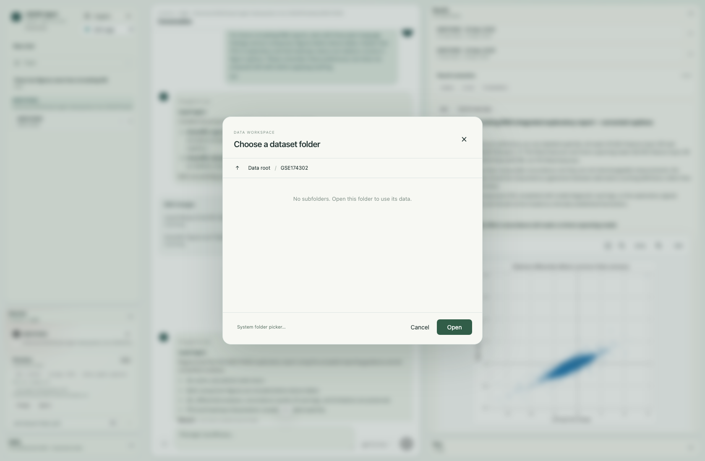](../assets/current-workspace/01-choose-dataset.png)

Choose the dataset directory with the folder picker, then Open.
Wait for **Source scanned**. Check Sources before asking for a comparison: this run shows **CRC: 54 · healthy: 19**, complete label coverage and one attached source. “Supervised-ready” is a technical metadata indicator, not a clinical-validity assessment.

The scan identifies six prepared input files and the 73-sample metadata; no analysis has run yet.
## 2. Discuss the study before running it

We entered this question:

> I am studying circulating RNA in colorectal cancer. Inspect the attached GSE174302 cohort and its two count matrices. Explain the sample groups and measurement differences, then propose a staged plan: QC each matrix, compare CRC with healthy samples, compare the two sets of results, and write an exploratory report. Use appropriate skills. Do not run the analyses yet.

The agent inspected the workspace, loaded relevant guidance and published a four-step runnable plan: two QC tasks and two differential-expression tasks. Cross-matrix comparisons were deferred until their prerequisites existed. A plan is not an executed result.

Review the proposed tasks in Plan before using Run next step.
You can open **Skills → Cohort Design and Statistical Validation** to read the guidance yourself. Selecting a skill opens its text; it does not execute an analysis or force every future message to use that skill. The agent can choose no skill, one skill or several as relevant.

[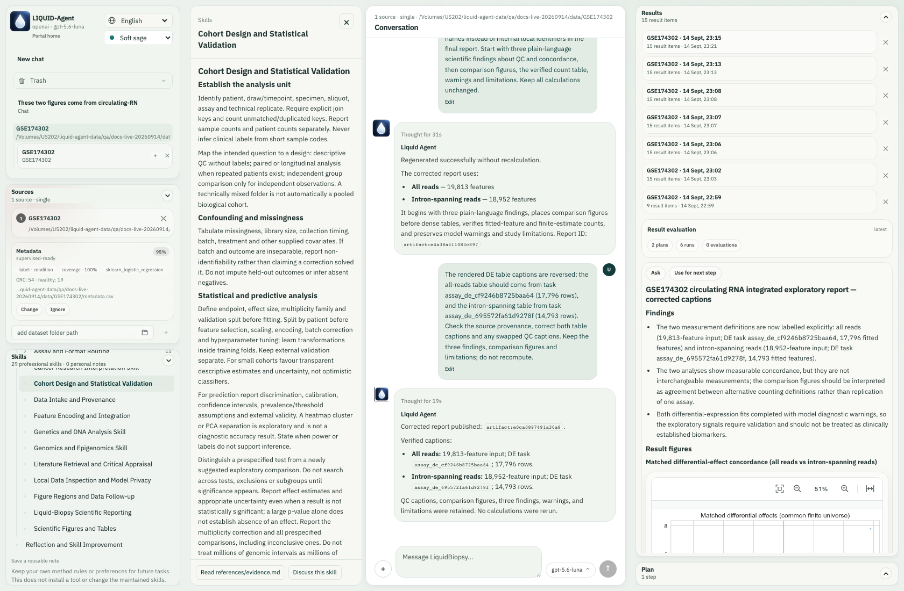](../assets/current-workspace/06-read-cohort-skill.png)

Read the cohort-design guidance, including confounding, analysis units and exploratory interpretation.
## 3. Run one step, then decide what comes next

Click **Run next step** in Plan. In this run the button submitted a scoped instruction to execute only the first matrix's QC, inspect its output and propose a next plan. The first matrix produced **73 samples × 19,813 features**, zero missing entries, a mean library size of approximately **3.64 million counts**, tables, a PCA plot and a feature heatmap. The second QC and both differential analyses had not run.

The first completed QC result appears alongside the answer; the remaining work is still separate.
Results has two different follow-up buttons:

| Button | What happened in this live example |
| --- | --- |
| **Ask** | Sent “Review result: Integrated analysis report”; later returned a numerical interpretation and caveats for the selected comparison report. |
| **Use for next step** | Sent “Use result for next step: Integrated analysis report”; returned a focused follow-up recommendation. It did not start another analysis. |
| **Run next step** (Plan) | Actually executed the recommended task. Review its scope first. |

[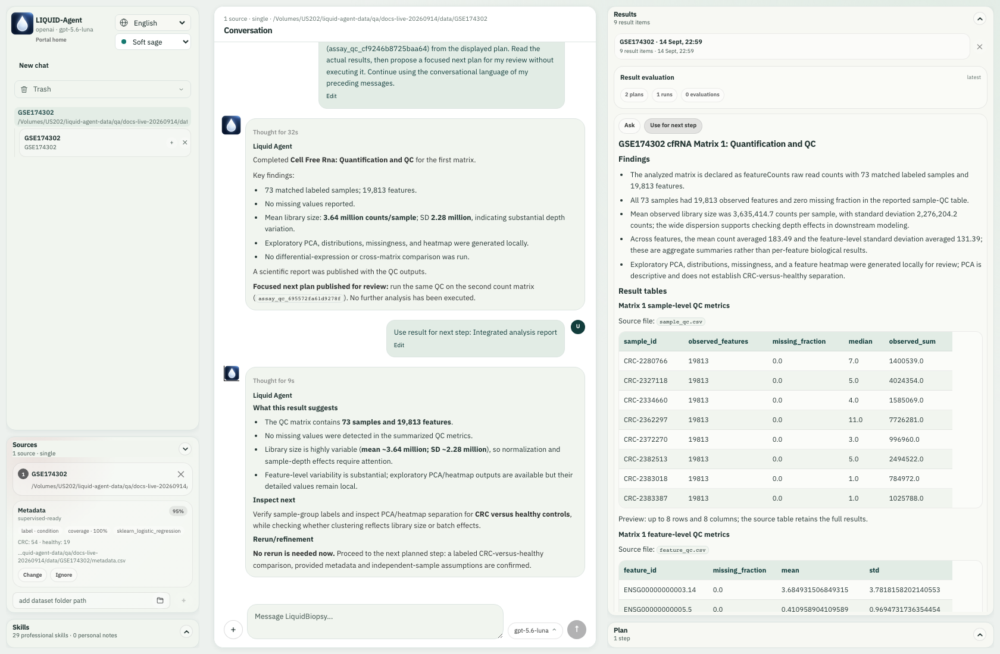](../assets/current-workspace/08-result-next-proposal.png)

Use for next step discusses what to inspect or run next; this click added no scientific job.
## 4. Authorize the longer workflow

After reviewing QC and the next-step advice, we entered:

> Proceed with QC of the second matrix and the CRC-versus-healthy differential analysis of each matrix. Then inspect the available comparison tasks and run matched-expression and differential-effect concordance. Keep the two measurement definitions separate, preserve model warnings, and publish an exploratory report. Reuse completed QC; do not rerun it.

The agent completed the remaining work with **six scientific runs in total**: two QC, two PyDESeq2 contrasts, expression concordance and differential-effect concordance. Later image questions and report revisions did not repeat these six runs.

During execution, the task's circle spins and its attached Sources are outlined. The conversation displays current operations and worker liveness, rather than leaving an unexplained blank wait. We refreshed during the live task and reconnected without resubmitting it.

[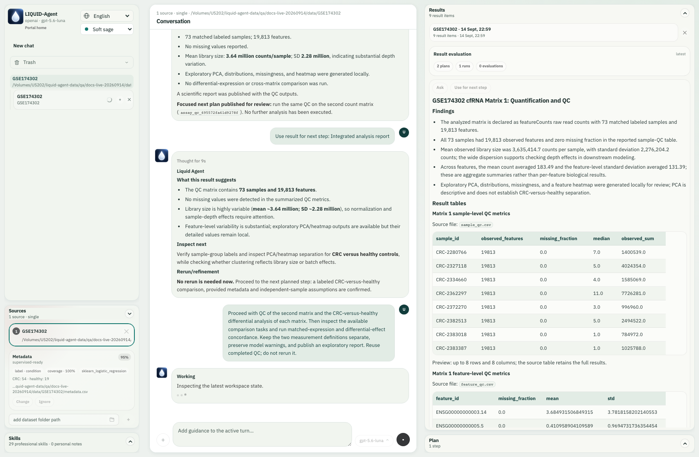](../assets/current-workspace/11-worker-progress.png)

The live turn displays its current operation, a spinning task indicator and the highlighted source. These are execution updates, not private reasoning.
The main task also completed while we were in the separate image-question conversation below. Its spinner became a blue **Task finished · unread** dot; opening the task cleared it. A blue dot means there is a terminal update to read, not that every task necessarily succeeded.

## 5. Ask about a region inside a result

Open the first QC entry in **Results history** and scroll to its PCA figure. Use **Select region to ask**, then **drag** across the right-hand points. Six mapped marks were selected in this example. Enter a question in the small field beside the selection and press Enter:

> Inspect these PCA outliers in the source data. Are they technical or biological? Do not exclude samples.

The PCA selection contains six exact mapped sample marks; the adjacent input submits the crop with its question.
The crop appeared in the user message. The agent inspected **118,878 finite source measurements across 19,813 features** for the six samples, then explained why their technical/biological cause remained unresolved. It did not remove samples. An exact mapping supplies a data link; it does not automatically supply every clinical or batch covariate.

[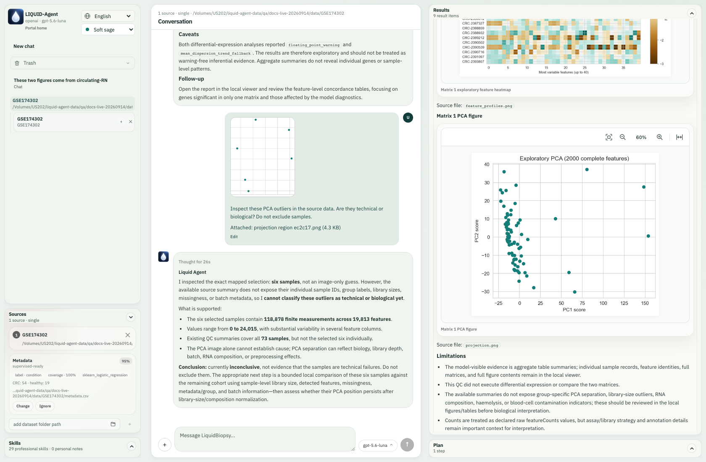](../assets/current-workspace/20-pca-grounded-answer.png)

The real answer uses the mapped data and states the limits of the PCA interpretation.
## 6. Combine crops from two different figures

This is a different interaction from immediate single-region submission:

1. Select the PCA region again. **Leave the small question field empty** and click its **+**. The main composer now shows one image and the **1/4** guidance.
2. Scroll to the **feature heatmap**, use **Fit to width** to inspect it, and select a block. This run mapped **165 cells, spanning 11 rows and 15 columns**.
3. Leave that field empty and click **+** too. There are now **two different figures** in the composer.
4. Enter one joint question and submit:

> Compare the PCA outlier region with this heatmap block. Inspect both mappings; explain their units and whether they identify the same samples. Summarize the selected data separately and write a short follow-up report. Do not merge selections or rerun differential analysis.

[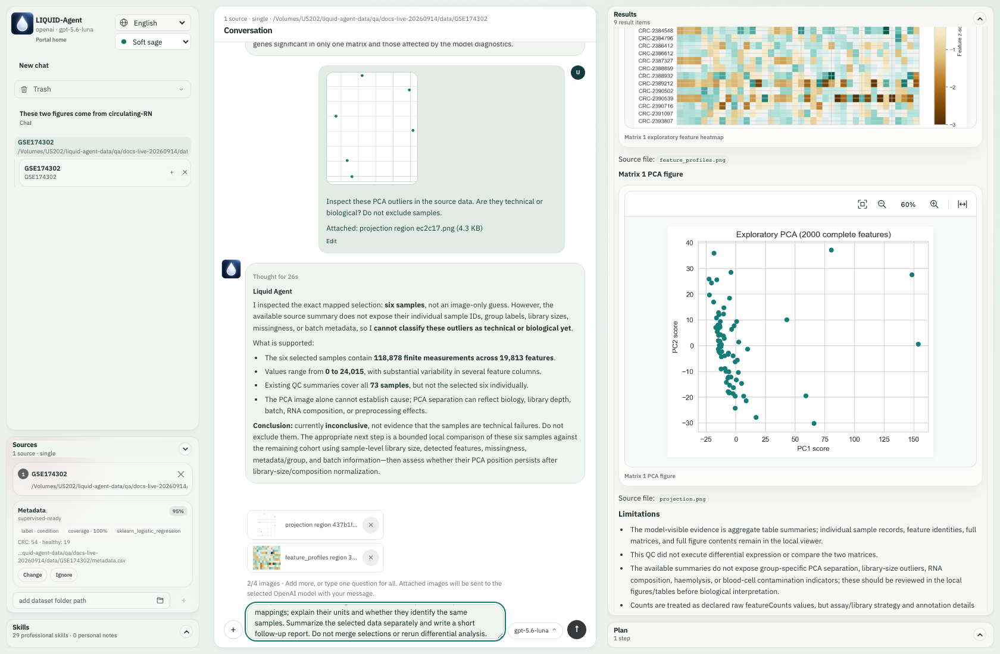](../assets/current-workspace/24-two-regions-joint-question.png)

The composer holds a PCA crop and a heatmap crop, with the 2/4 reminder and a shared question.

[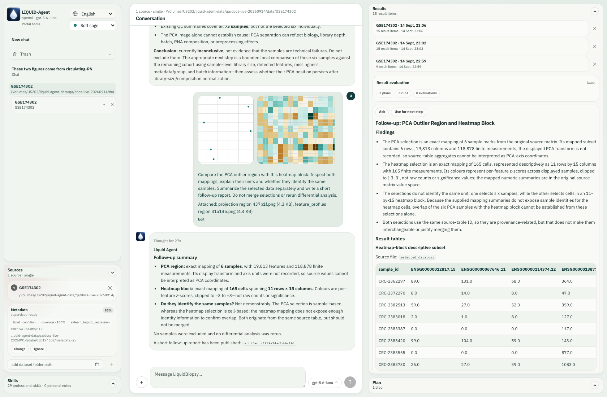](../assets/current-workspace/25-joint-answer-and-selected-table.png)

Both crops remain in the sent message; Results displays the newly generated selected-data table and follow-up report.
The answer distinguished **sample marks** from **heatmap cells**, and raw counts from per-feature z-scores. The available aggregate mappings did not establish that the two selections represented the same individuals. The agent reported that limitation, preserved separate selections and did not rerun differential expression. Read the [illustrated figure-input guide](../guides/images-and-result-actions.md#live-example-two-figure-follow-up) for the intermediate selection and upload screens.

## 7. Teach a reusable preference and review the changes

We then asked:

> For future circulating-RNA reports, start with three plain-language findings and put comparison figures before dense tables. Explain that PCA is exploratory and that heatmap colours are relative z-scores in figure captions. Please remember these preferences, but show me proposed skill edits before applying anything.

The real API turn drafted changes to **Liquid-Biopsy Scientific Reporting** and **Scientific Figures and Tables**. Neither was initially applied. Click a name in the compact **Skill changes** card to inspect the red deletions and green additions.

Review the actual proposed reporting change before accepting it.
For this example we **accepted the reporting hunk** and **rejected the separate figure-skill draft** using the small controls at the right of its Skills row. These were actual review actions in the isolated skill library. You may make a different choice; a proposed edit is not an obligation.

The card stays with its originating conversation turn. A later message scrolls it into history; pending actions can still be found at the right end of the relevant Skills row. See [the skill-review screenshots](../guides/professional-skills.md#live-review-example) for both locations.

## 8. Revise the report without recomputing the matrices

We requested a full report using the accepted guidance, both comparison figures, completed analyses and model warnings, explicitly saying **“Do not repeat matrix calculations.”** We also asked the agent to check the assignment of counts to `all.csv` and `intron.csv`, rather than relying on ambiguous “matrix 1/2” order. Review caught swapped DE captions; a general request to check them was insufficient. We supplied the verified task-to-definition correspondence and checked the corrected rendered tables against the source outputs. This was a report correction, not proof that the application now prevents every caption error.

Review the report in Results: read the findings, scroll through the figures, inspect the tables and finish at limitations and next questions. The figure toolbar supports zoom and width fit; wide tables scroll within their panel. Opening an earlier Results-history entry does not rerun the study.

[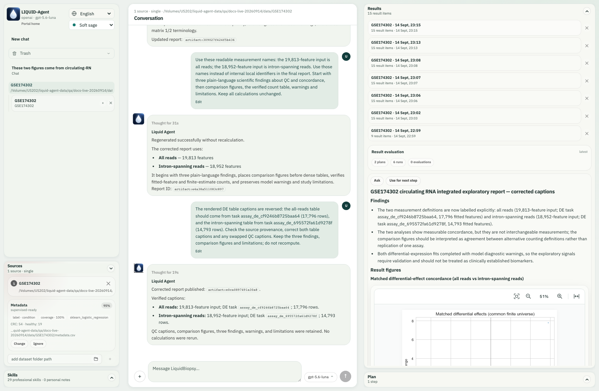](../assets/current-workspace/30-final-report-findings.png)

The revised report uses accepted guidance and retained scientific outputs.

[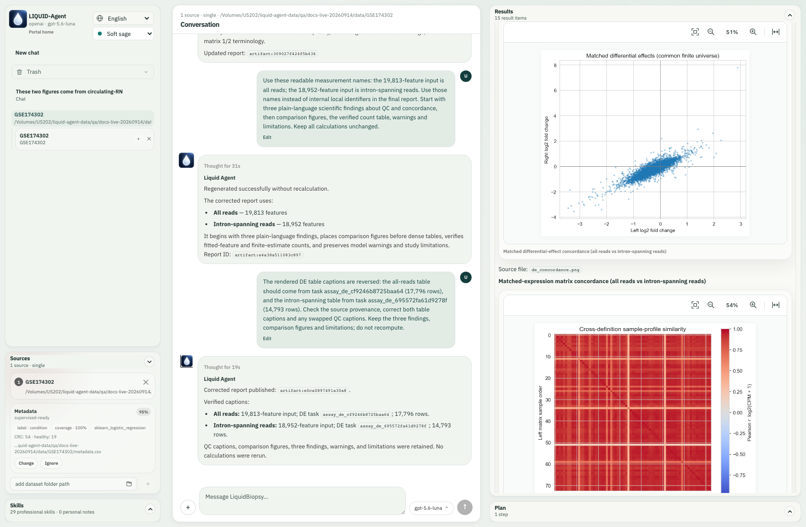](../assets/current-workspace/31-final-report-comparisons.png)

Scroll through both comparison figures before reviewing the numerical tables.

[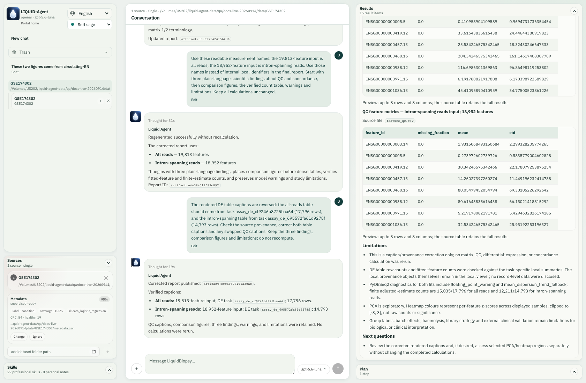](../assets/current-workspace/36-report-limitations.png)

Finish at limitations and next questions; the model warnings remain visible.

This run found mean matched-expression Pearson/Spearman correlations of **0.937/0.923**, differential-effect Pearson correlation **0.885**, and **288** overlapping significant features (Jaccard **0.389**). These are agreement measures from the **same cohort**, not independent validation. Both fits emitted numerical/dispersion-model diagnostics. The exploratory design does not adjust for unprovided age, sex or batch covariates and does not establish a diagnostic test.

## 9. Ask with uploaded images, even without attaching a dataset

In a separate **New chat → Later** conversation, we used **+** to upload the actual PCA and heatmap PNG files and asked:

> These two figures come from circulating-RNA QC. I am new to this: what is the difference between the PCA scatter plot and the feature heatmap? Does either prove that cancer can be diagnosed? Explain the colour scale and what information is still missing.

[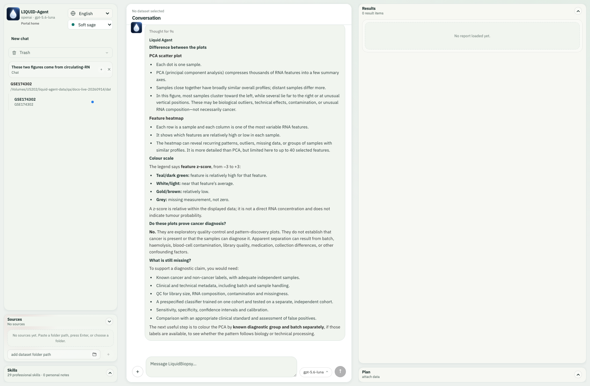](../assets/current-workspace/14-upload-answer-unread.png)

The image-only conversation receives a real multimodal answer; the completed study has an unread blue dot in the sidebar.

Both uploaded figures and the question are visible together in the conversation.

The answer explained samples versus features, the −3 to +3 relative colour scale and the lack of diagnostic evidence. This separate chat had **no attached matrix or region provenance**. Uploading a PNG is suitable for visual questions; it does not recreate the source mapping of a Results selection.

## 10. Recover, restore and find the next example

Images and answers remain in their conversation after reload. **Trash** moves a task and its owned outputs/uploads out of the active list; **Restore** returns that task. Original input datasets remain separate. Permanent deletion is a different, irreversible action. The screenshots below show the isolated image conversation moved to Trash and restored, not deletion of the study inputs.

The isolated image conversation in Trash, with its Restore action.
For **Stop**, **Guide**, missing-disk handling and service-restart recovery, consult [runtime controls](../guides/images-and-result-actions.md#ongoing-tasks-and-refresh).

Use [scenario prompts](natural-language-examples.md) to adapt this workflow to a different question. This study is an example; assess suitability for your own assay and research question.

<!-- BEGIN CHINESE TRANSLATION -->

---

# 真实 cfRNA 任务：从数据到报告的图文实操

本页跟随一个研究任务，依次完成队列检查、质控、差异分析、图中追问和报告审阅。**截图展示使用 OpenAI API 与 GSE174302 数据的真实浏览器流程。** 回答在该流程中生成，图表由本地科学工具实际生成。点击截图可查看 **1680 × 1100** 的完整工作区原图。

## 开始前准备

- `liquid-agent` 默认打开 Web；`liquid-agent web` 也可用。终端对话使用 `liquid-agent cli`，公开主页和文档使用 `liquid-agent wiki`。
- 在输入框旁的模型菜单 → **Manage keys** 配置 OpenAI key。当前通过 `auto` 使用 `gpt-6-luna`；较早截图可能保留拍摄时可用的型号。截图不显示密钥。详见[密钥存储与模型选择](../guides/openai-configuration.md)。
- 保持数据盘挂载。本示例使用单独的工作目录，避免影响已有任务。

输入是**事先准备的公开研究子队列**，不是整个 GSE174302：同一招募中心的 54 个结直肠癌与 19 个健康样本，保留所有 mRNA 注释行。`all.csv` 有 19,813 个特征，`intron.csv` 有 18,952 个特征，二者均为相同的 73 个样本；另有 `metadata.csv`、两份 `.assay.json` 和 `provenance.json` 记录分组、计数定义与来源哈希。

本示例使用依据公开元数据预先准备的队列；**选择文件夹不会自动完成这一步队列整理**。自己的数据需遵循[检测表格约定](../guides/assay-tables.md)，并记录研究来源和准备方法。不要仅凭文件名推断病例／对照标签。

## 1. 选择目录，核对队列

点击 **New chat → Choose folder**，或 Sources 的文件夹图标，进入准备好的 GSE174302 目录后点 **Open**。选择器只列目录，所以“No subfolders”不代表所选目录没有数据文件。

用目录选择器进入数据集，再点击 Open。
等待出现 **Source scanned**。先核对 Sources：本例为 **CRC: 54 · healthy: 19**，标签覆盖完整，一个数据源。“Supervised-ready”表示技术上的元数据可用性，不代表临床验证。

扫描识别六个准备好的输入文件及 73 个样本的元数据；此时尚未分析。
## 2. 先讨论研究，再执行分析

实操输入了以下英文问题；中文也可以表达相同要求：

> 我研究结直肠癌的循环 RNA。检查 GSE174302 队列和两种计数矩阵，解释分组与测量差异，提出分阶段计划：分别质控、分别比较 CRC 与健康样本、比较两组分析结果、形成探索性报告。使用合适的技能，暂时不要执行分析。

智能体检查工作区、读取相关指导，发布了四个可运行步骤：两项质控、两项差异分析。跨矩阵比较要等前置结果产生后再选择。计划不是已经完成的结果。

在 Plan 审阅任务，再决定是否执行下一步。
也可以打开 **Skills → Cohort Design and Statistical Validation** 阅读队列设计指导。点击技能只是查看内容，不会运行分析，也不会强制后续所有消息都使用它；智能体按需要选择不使用、一个或多个技能。

查看真实技能内容，包括混杂因素、分析单位和探索性解释。
## 3. 先执行一步，再决定后续

点击 Plan 的 **Run next step**。本次按钮提交了限定指令：只运行第一张矩阵的质控、检查结果、提出后续计划。实际得到 **73 个样本 × 19,813 个特征**，无缺失值，平均每样本约 **364 万计数**，以及表格、PCA、特征热图。此时第二项质控和两项差异分析尚未执行。

第一项 QC 完成，回复和结果同时呈现；其余任务仍单独保留。
几个按钮有明确区别：

| 按钮 | 本次真实行为 |
| --- | --- |
| Results 的 **Ask** | 发送所选报告的解释请求；在比较完成后实际返回数值解读和限制。 |
| Results 的 **Use for next step** | 根据所选结果提出聚焦建议，没有新增科学计算。 |
| Plan 的 **Run next step** | 实际执行推荐任务，点击前应审阅范围。 |

Use for next step 返回下一步建议，本次点击没有启动新分析。
## 4. 授权连续多步骤任务

核对质控和后续建议后，再输入：

> 继续第二张矩阵的质控和两种矩阵各自的 CRC 对健康差异分析。随后检查可用的比较任务，执行匹配样本表达一致性和差异效应一致性比较。保留两种计数定义、模型警告，发布探索性报告。复用已完成质控，不要重复。

累计完成 **6 次科学运行**：两项 QC、两项 PyDESeq2 对比、表达一致性和差异效应一致性。之后的图片追问与报告修改没有重复这六次运行。

运行时任务旁圆圈旋转，Sources 中所属数据源高亮；对话显示当前操作和工作进程状态。本次在运行中刷新浏览器，成功接回任务，没有再次提交问题。

正在执行的回合显示当前操作，任务旁有旋转指示，使用的数据源高亮。这些是执行状态，不是私有推理内容。
切换到下文的独立图片对话后，主任务完成，圆圈变为蓝色 **Task finished · unread** 圆点；再次打开主任务后消失。蓝点只表示有结束更新待查看，不保证每个任务都成功。

## 5. 直接在结果图里框选追问

在 Results 历史里打开第一项 QC，滚到 PCA。点击 **Select region to ask**，从一角**拖动**到另一角，选中右侧点。本例选中了 6 个精确映射标记。在选框旁的小输入框提问并回车：

> 检查这些 PCA 离群样本对应的源数据。这是技术差异还是生物学差异？不要排除样本。

PCA 选区包含六个精确映射的样本点，小输入框可直接提交图片和问题。
截图随用户消息进入对话。智能体检查了六个样本在 19,813 个特征上的 **118,878 个有限测量值**，并说明现有信息无法判断异常原因，没有删除样本。精确映射建立了数据关联，不会凭空补全所有临床或批次信息。

真实回复依据选区数据作答，也明确保留 PCA 解释的限制。
## 6. 从两张不同图暂存截图，统一提问

这与上一节立即发送单图问题不同：

1. 再次选择 PCA 右侧区域，小输入框**留空**，点击旁边 **+**。主输入框出现第一张截图及 **1/4** 提示。
2. 滚到**特征热图**，用 **Fit to width** 查看后框选一个区域。本例映射到 **165 个单元格，即 11 行 × 15 列**。
3. 同样留空点击 **+**。此时主输入框中是来自**两张不同图**的截图。
4. 输入一个综合问题并发送：

> 比较 PCA 离群点区域和这块热图。检查二者的映射，解释单位、是否对应同一批样本。分别汇总选中数据，生成简短追问报告。不要合并选区，也不要重跑差异分析。

主输入框中暂存 PCA 与热图截图，显示 2/4 提示，并配有同一个问题。

发送后两张截图仍随消息显示；Results 出现新生成的选区数据表和追问报告。
回复区分了**样本点**与**热图单元格**，以及原始计数与逐特征 z-score。现有汇总映射不能确认两个选区是否为同一批个体，因此明确说明这一限制，没有自动合并，也没有重复差异分析。更多中间步骤与上传截图见[图片实操指南](../guides/images-and-result-actions.md#live-example-two-figure-follow-up)。

## 7. 教给系统可复用偏好，再审阅修改

接着提出：

> 以后写循环 RNA 报告，先列三个通俗发现，再把比较图放在密集表格前面。图注说明 PCA 是探索性的、热图颜色是相对 z-score。请记住这些偏好，但先展示技能修改草案，不要直接应用。

真实 API 回合草拟了 **Liquid-Biopsy Scientific Reporting** 和 **Scientific Figures and Tables** 两份修改，最初均未应用。点击紧凑的 **Skill changes** 卡片名称，可以看红色删除和绿色新增。

先查看实际报告技能修改的红绿差异，再决定是否接受。
本例**逐条接受了报告技能修改**，又通过 Skills 对应横条最右侧的小按钮**拒绝了独立的绘图技能草案**。这些是真实的审阅操作，只作用于隔离的私人技能目录；读者可以作出不同选择。

修改卡片留在产生它的对话轮次。新消息会将它滚入历史；仍待审阅的内容可在 Skills 横条右侧找到。[技能审阅指南](../guides/professional-skills.md#live-review-example)有两个位置的完整截图。

## 8. 改写报告，不重新计算矩阵

之后要求使用已接受的指导和全部完成结果，保留两张比较图、模型警告，明确说**不要重复矩阵计算**。也要求逐项核对 `all.csv` 与 `intron.csv` 对应的统计数量，避免含糊的“矩阵 1／2”顺序。审阅发现 DE 标题互换，仅笼统要求检查还不够；我们提供核实过的任务与测量定义对应关系，并对照源输出确认修正后的表格。这是本报告的纠正，不代表系统已能阻止所有标题错误。

在 Results 看完整报告：先读发现，再下滑查看图、表，最后到限制和后续问题。图形工具栏支持缩放与宽度适应；宽表在自身区域横向滚动。打开旧 Results 历史条目不会重新计算研究。

修改后的报告使用接受的指导和已保留的科学结果。

下滑查看两张比较图后，再检查数值表格。

浏览到限制和后续问题，模型警告仍清楚保留。

本次匹配表达 Pearson／Spearman 均值为 **0.937／0.923**，差异效应 Pearson 为 **0.885**，重叠显著特征 **288** 个，Jaccard 为 **0.389**。它们是**同一队列**两种测量定义的一致性，不是独立验证。两项拟合均保留数值／离散度模型诊断；当前探索性设计未校正缺失的年龄、性别、批次等因素，不能据此宣称诊断性能。

## 9. 不附加数据集，也能上传图片提问

另开 **New chat → Later**，用 **+** 上传实际生成的 PCA 和热图 PNG，输入：

> 这两张图来自循环 RNA 质控。我是初学者，PCA 散点图和特征热图有什么区别？哪一张能证明可以诊断癌症？解释配色，以及还缺少哪些信息。

独立图片对话得到真实多模态回答；左侧主研究任务已完成，显示未读蓝点。

两张上传图片与对应问题一起显示在对话中。

回答解释了样本／特征、−3 至 +3 的相对配色与诊断证据缺口。这一独立对话**没有附加矩阵，也没有选区溯源信息**；上传 PNG 可以询问图意，但不会重建 Results 选区的数据关联。

## 10. 恢复任务，继续学习

图片和回答在刷新后仍留在所属对话。**Trash** 将任务及其输出／上传附件移出活动列表，**Restore** 可以恢复；原始数据文件独立保留。彻底删除是另一个不可逆操作。下面实际演示的是将独立图片对话移入垃圾箱并恢复，不是删除研究输入。

隔离图片对话进入 Trash 后，可以用 Restore 恢复。
**Stop**、**Guide**、缺盘处理和服务重启恢复见[运行控制](../guides/images-and-result-actions.md#ongoing-tasks-and-refresh)。

可继续使用[场景提问示例](natural-language-examples.md)，把本流程改写为其他问题。请根据自己的检测类型和研究问题判断适用性。
