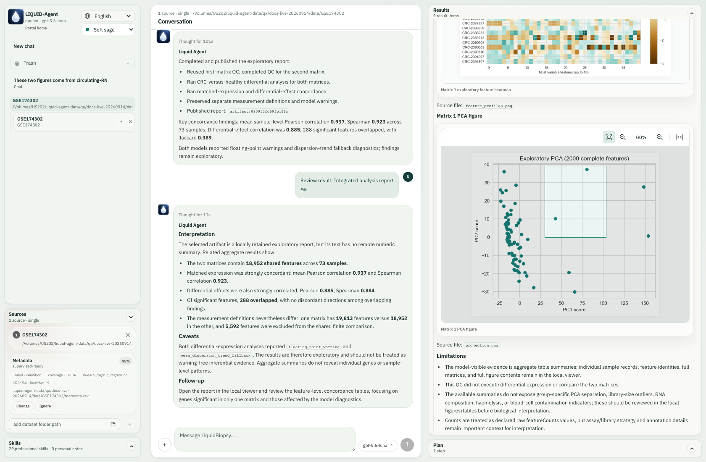
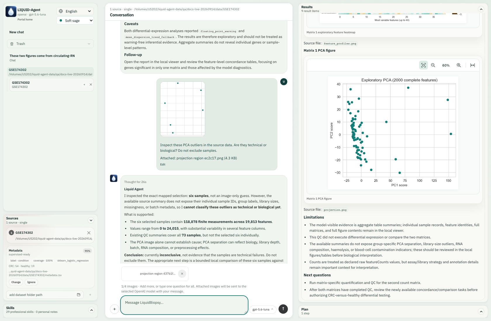
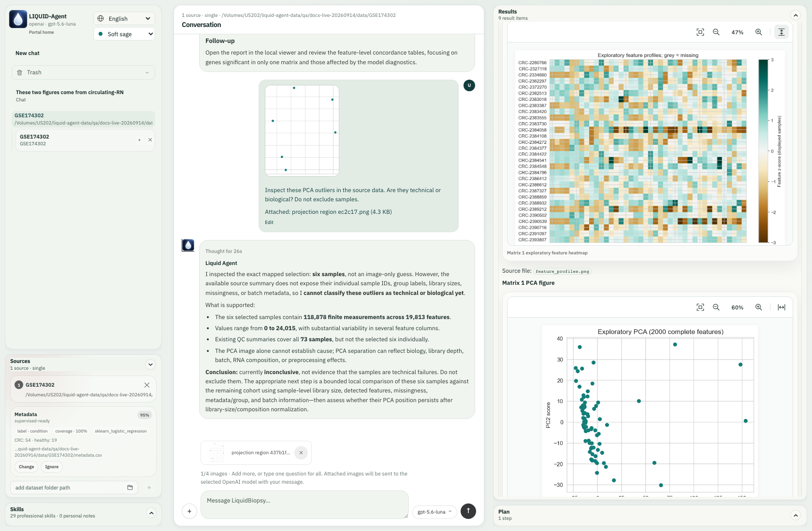
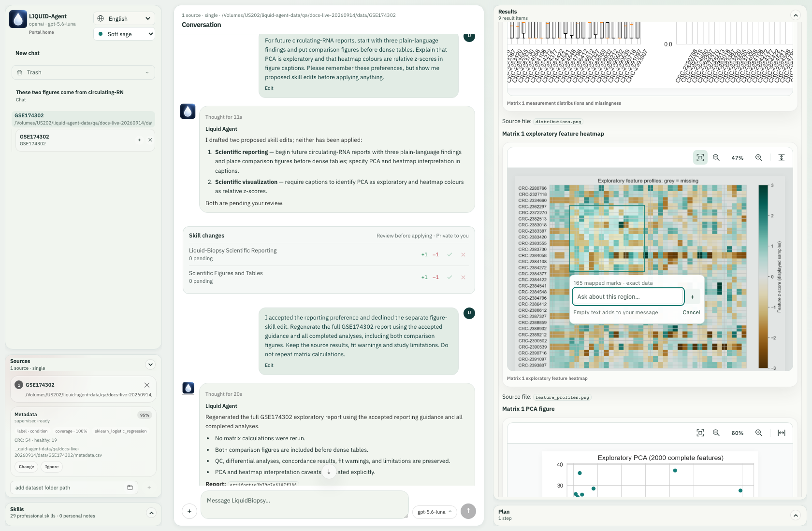
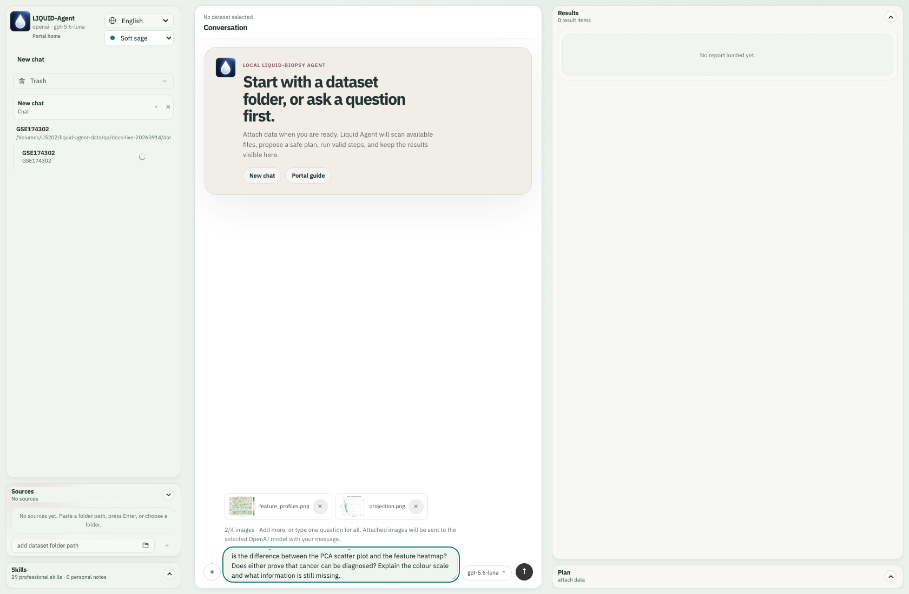

[English](#english) | [简体中文](#chinese)

# Images and Result Follow-ups

The Web conversation accepts images through **+**, clipboard paste, or file
drag-and-drop. Add a question, or send an image alone for inspection. Up to four
images can accompany a message. PNG, JPEG, WebP and non-animated GIF are accepted;
each image is limited to 20 MB and 32 million decoded pixels. Images are normalized
to PNG with metadata removed before they are sent to the selected OpenAI model.
The normalized image must also fit the size limit. Other uploaded files remain
local; uploading a table does not send the entire table to the model.

The composer shows the image count from the first attachment. At four images it
explains how to remove and replace one; another upload or crop gives a visible
limit message instead of silently doing nothing.

Examples include identifying an unfamiliar plot, discussing an apparent outlier
or missing region, comparing two plotting styles, explaining a correlation
heatmap, or using a screenshot as a visual specification for a future figure.
The model should distinguish visible evidence from missing source data. A
screenshot cannot establish exact counts, statistical significance or clinical
validity. Reproducing a scientific plot requires the actual data and an authorized
analysis. Instructions embedded inside a picture are treated as untrusted content.

Attached images are displayed with the corresponding user message, survive
reloads, and remain owned by that conversation. New attachments are distinguished
from earlier visual context. Deleting the conversation uses the existing Trash
flow for its uploads and outputs. Image messages currently require OpenAI; the
application reports an error if a different provider is selected.

In the interactive CLI, use `/image "/path/to/figure.png" What does this show?`.
The explicit attachment uses the same normalization, ownership and model input
contract as Web. Ordinary references to a local figure do not send it automatically.

## Plan and Results Controls

- **Run next step** executes the current plan's recommended runnable step. It is
  an execution action, so use it after reviewing that step. Completion updates
  results and task status; it does not authorize every remaining step.
- **Ask** sends the selected result and bounded local preview context to the
  agent for explanation. It asks what the result means and what its limits are.
- **Use result for next step** asks the agent to use that result to propose a
  focused follow-up. It does not itself authorize another scientific run. Review
  the proposal before requesting execution.

The selected result is preserved in these follow-up prompts. Unsupported or
incomplete results should be identified honestly, without inventing missing
figures, statistics or an automatically completed pipeline.

## Ongoing tasks and refresh

During a turn, the conversation shows temporary operation updates, measured
worker progress when available, and periodic liveness when no count is available.
These updates are replaced by the final answer; they are not private reasoning.
Native context compaction is announced while it runs and when it completes.
Completed local results and the visible conversation are retained.

**Guide** adds an instruction to the active turn; **Stop** requests cancellation
and keeps completed outputs. Refreshing the same browser conversation reconnects
to its recorded running job without submitting the question again. If the local
service itself restarted, the UI explains that the old running job is unavailable;
ask to continue unfinished work from retained results. Browser storage must be
available for refresh recovery.

## Figure regions and source data

In Results, use **Select region to ask** in a figure toolbar, then drag a rectangle. A compact question field appears next to the selected region. Type a question and press Enter to send that crop as a normal image-and-text message. Leave it empty and press **+** to collect the crop in the main composer. Collect up to four images, remove any unwanted attachments, and send them with one shared instruction. Escape or Cancel dismisses a selection. Zoom and fit controls remain available; begin a new selection after changing the view.

The selection includes the **centres of mapped marks**, not every shape touched by the rectangle. Labels, legends and whitespace do not identify data. New assay-table PCA plots map to original matrix samples; feature heatmaps map to original-scale cells; differential-expression plots map to matrix features. New cfDNA sample-by-bin heatmaps map to their exported normalized signal table. Old figures and other plots support image questions but do not acquire an exact data mapping retroactively. The popover explicitly distinguishes exact mapped marks from image-only regions.

The image and its provenance remain in the conversation's output location. The source figure and table are checked for changes before any selected-data operation. For a numerical follow-up the agent can inspect the selection without writing files, or, when requested, produce a separate selected-data table, descriptive statistics, provenance and report. Numerical tool responses keep identifiers local; the selected image itself is sent to the configured OpenAI model, including any visible labels. This tool does not fit a differential model or infer groups: a more advanced method still requires compatible inputs, an appropriate analysis design and a supported scientific capability. Multiple selections are not silently merged.

New assay feature heatmaps also record their display transform: per-feature z-scores across the displayed samples, clipped to [-3, 3], with brown negative and teal positive. These colours are distinct from the original matrix values available through selection inspection. If a figure does not record its transform, the agent should not infer its scale from source-value summaries. Opaque source identifiers distinguish crops from different figures and tables even when their filenames match.

## Live example: two-figure follow-up

These full-workspace screenshots were captured during the real GSE174302/OpenAI browser run, not from UI fixtures. Follow the [complete research workflow](../getting-started/workspace-walkthrough.md) to produce the QC report first. Use the first QC entry in Results history; opening it does not rerun QC.

### Select and ask immediately

Scroll to the PCA, click **Select region to ask**, and drag across the right-hand points. Release the mouse, wait for the mapping count, then type beside the box. In this run, **6 mapped marks · exact data** referred to six samples. The question was: “Inspect these PCA outliers in the source data. Are they technical or biological? Do not exclude samples.” Pressing Enter submitted it immediately.

During the actual mouse drag, the selection rectangle grows across the PCA.

After release, the compact question field and exact mapping count appear.

The actual answer inspected 118,878 finite source measurements for six samples across 19,813 features. It could not establish technical versus biological causation. The crop is now part of the user message, rather than a detached temporary note.

The submitted image, question and real source-grounded answer remain together.

### Stage one crop, then choose another figure

Select the PCA region again, leave its question field **empty**, and click the adjacent **+**. This adds an attachment without calling the model. The main composer shows **1/4** and explains how to add more.

The first PCA crop is staged for a later shared question.

Move to the **feature heatmap**, rather than taking an almost identical crop from the PCA. Use **Fit to width**; a tall image can then be scrolled vertically inside its viewer. Zoom controls change the view, not the source measurements. Make the next selection after adjusting zoom.

Width fit makes heatmap cells easier to inspect.

The heatmap block is selected separately; this block maps to 165 cells across 11 rows and 15 columns.

Click the empty field's **+**, then enter one question in the main composer:

> Compare the PCA outlier region with this heatmap block. Inspect both mappings; explain their units and whether they identify the same samples. Summarize the selected data separately and write a short follow-up report. Do not merge selections or rerun differential analysis.

Two different crops and one shared instruction are ready to send.

The real response distinguishes the selection units and publishes local selected-data tables.

The live answer did **not** establish sample overlap from the bounded mapping summaries. It distinguished sample selection from cell selection, preserved them separately, and explained that heatmap colours are clipped relative z-scores while its numerical subset contains source counts. New selected-data/statistics files were produced; the six completed matrix/QC/comparison jobs were not rerun. An exact data link is not a guarantee that every requested analysis or metadata join is implemented.

### Upload existing PNGs instead

In **New chat → Later**, use **+** to upload the two complete QC PNGs. We asked what PCA and heatmap represent and whether either proves cancer diagnosis. This was a separate real multimodal API call without an attached dataset.

The actual PCA and heatmap files are attached through the upload input, with the 2/4 guidance.

The model explains the uploaded images and the missing diagnostic evidence.

The two uploaded figures stay with their actual question after reload and restoration.

An uploaded PNG carries pixels, not the Results selection's data linkage. For exact measurements, return to the dataset's Results figure and use its mapped selection. For visual explanations, screenshots from outside the app are valid inputs too. Paste and drag-and-drop are alternate input routes; these captures specifically exercised file upload and Results cropping.

Results currently embeds static figures with the application's own zoom, pan and region controls. A generated Plotly HTML file is not automatically an interactive Plotly panel in Results.

<!-- BEGIN CHINESE TRANSLATION -->

---

# 图片输入与结果追问

Web 对话支持通过左下角 **+**、剪贴板粘贴、拖拽文件添加图片。可以图片加文字，
也可以只发送图片。每条消息最多四张图片；支持 PNG、JPEG、WebP、非动画 GIF。
每张最多 20 MB、解码后 3200 万像素。图片去除元数据并转为 PNG 后，发送到
用户选定的 OpenAI 模型；转换后的文件也必须满足大小限制。其他附件仍留在本地，
上传表格不代表把完整表格传给模型。

从第一张附件起，输入框就显示图片计数。达到四张后，会提示先移除再替换；继续上传
或截图会显示上限提示，而不是没有反馈。

可用于识别图表类型、讨论异常点或缺失区域、比较两种绘图风格、解释相关性热图，
或把截图作为后续绘图的风格参考。截图无法替代原始数据，也不能确立精确计数、
显著性或临床有效性；真正复现科学图表需要数据和执行授权。图片内嵌的指令不会
成为修改系统行为的授权。

图片与对应用户消息一同显示，刷新后保留，并归属于该对话。新图片与历史图片上下文
区分处理。删除对话时，附件及输出沿用已有垃圾箱流程。当前图片消息要求使用 OpenAI；
选择其他提供商时会明确报错。

交互式 CLI 使用 `/image "/path/to/figure.png" 这张图表示什么？`，
与 Web 共用图片规范化、归属校验及模型输入链路。只提到本地图片路径不会自动上传它。

## Plan 和 Results 按钮

- **Run next step**：执行当前计划推荐的可运行步骤。点击意味着执行该步骤，
  完成后更新结果与状态，不等于授权所有后续步骤。
- **Ask**：围绕当前选中的结果及受限本地预览进行解释，说明含义和局限。
- **Use result for next step**：以选中结果为依据，请智能体规划聚焦的下一步，
  按钮本身不授权新的科学计算。先审阅，再要求执行。

结果追问会保留所选条目的身份。对不完整或不支持的结果，系统应说明限制，
不能编造缺失图形、统计结果或已经完成的流水线。

## 长任务与刷新

执行期间，对话区临时显示当前操作、工具提供的真实完成进度，或在暂无计数时定期报告
工作进程仍在运行。最终回答会替换这些状态；它们不是模型的私有思维链。原生上下文
压缩开始、完成时也会显示提示，已完成的本地结果和可见对话会保留。

**Guide** 可向当前回合追加指令，**Stop** 请求取消并保留已完成输出。同一浏览器对话
刷新后会接回已记录的运行任务，不会重新提交问题。如果本地服务本身重启，界面会明确
说明旧的运行任务已不可用；可要求基于保留的结果继续未完成工作。刷新恢复需要浏览器
允许本地存储。

## 图中选区与数据溯源

新生成的 assay 特征热图还会记录显示变换：在显示的样本之间按特征计算 z-score，并截断到 [-3, 3]，棕色为负、青色为正。这与选区检查返回的原始矩阵数值不同；旧图没有记录变换时，不应根据原始数值汇总推断配色尺度。匿名来源标识可区分不同图表和源表，即使文件名相同。

在 Results 的图形工具栏点击 **Select region to ask** 后拖动选框，即可在旁边的小输入框中提问。输入文字并回车会发送正常的图片＋文字对话；不输入文字、点击 **+** 会将截图加入底部输入框，可累积最多四张图片后统一提问。Escape 或 Cancel 取消选区。缩放或调整适应方式后可重新框选。

数据选择以落入框内的**数据标记中心**为准，标题、图例、空白和仅碰到边缘的误差线不代表数据。新生成的 assay-table PCA 图对应原始矩阵样本，特征热图对应原始测量单元格，差异图对应矩阵特征；cfDNA sample-by-bin 热图对应导出的归一化信号表。旧图和其他图仍可截图提问，但不会凭像素自动获得精确数据映射。浮层会明确显示映射数量或“仅图片”。

选区及其来源保存在当前对话的数据目录中；计算前会检查原图和源表是否改变。数值工具向模型返回汇总信息；截图本身（包括可见标签）会发送给所选的 OpenAI 模型。用户要求分析时，系统可另外生成选中数据表、描述性统计、来源记录和报告，不修改原结果，也不自动合并多张截图。差异建模等进一步任务仍需满足输入、队列设计和已有工具能力的要求，不能把描述性统计冒充所请求的高级方法。

## 真实实操：从两张图追问

以下完整界面截图来自 GSE174302 与真实 OpenAI API 的浏览器操作，不是预置回答。先按[完整研究教程](../getting-started/workspace-walkthrough.md)产生 QC 报告，再打开 Results 历史里的第一项 QC；查看历史不会重跑质控。

### 框选后立即提问

滚到 PCA，点击 **Select region to ask**，拖动选中右侧的点，松开鼠标并等待映射数量出现。本例为 **6 mapped marks · exact data**，对应六个样本。在旁边输入“检查这些 PCA 离群样本的源数据，是技术差异还是生物学差异？不要排除样本”，按 Enter 立即提交。

实际拖动时，选框随鼠标移动而扩大。

松开后显示小输入框及精确映射数量。

实际回答检查了六个样本在 19,813 个特征上的 118,878 个有限测量值，并说明无法据此判断技术／生物学原因。截图随用户消息进入对话，而不是临时悬浮便签。

发送的图片、问题和真实溯源回答保留在同一对话中。

### 先暂存，再去另一张图

再选一次 PCA 区域，小输入框**留空**，点击旁边 **+**。这一步只加附件，不请求模型；主输入框显示 **1/4**，提示可以继续添加。

第一张 PCA 截图暂存在主输入框中。

接着移动到**特征热图**，不要在同一 PCA 里截取几乎相同的位置。点击 **Fit to width**；细长图片可在查看器内上下滚动。缩放改变的是显示大小，不是源测量值，调整完后再选区。

宽度适应后，可以更清楚地观察热图单元格。

单独选择热图区域，本例为 11 行、15 列，共 165 个映射单元格。

再次留空点 **+**，然后在主输入框统一提问：

> 比较 PCA 离群点区域和这块热图，检查映射、单位、是否对应同一批样本。分别汇总选中数据，生成简短报告；不要合并选区或重跑差异分析。

两张不同截图和一个综合问题准备发送。

真实回复区分选区单位，并发布本地选中数据表。

本次回复**没有**从受限的映射汇总推定样本重叠，而是保留两组选择，区分样本与单元格、截断后的相对 z-score 与源计数。产生了新的选区表和描述统计，之前六项 QC／矩阵／比较任务未重跑。精确数据关联不等于所有后续方法或元数据连接都已实现。

### 也可以上传已有 PNG

另开 **New chat → Later**，点击 **+** 上传两张完整 QC PNG，询问 PCA／热图区别及是否能证明癌症诊断。本次是在未附加数据集的新对话中进行的真实多模态调用。

通过上传控件加入实际 PCA 和热图，显示 2/4 提示。

模型解释上传图片及诊断证据缺口。

刷新和恢复后，两张上传图仍与实际问题一起保留。

上传 PNG 携带像素，不携带 Results 选区的数据关联。想检查精确测量值，应回到对应数据集的 Results 中框选；只解释图意时，应用外的截图也可以。粘贴和拖拽是其他入口；本组截图实际操作的是文件上传和 Results 框选。

Results 当前采用静态图配合应用自身的缩放、平移和选区工具。生成 Plotly HTML 不代表它会自动嵌入成 Results 中的 Plotly 交互面板。

