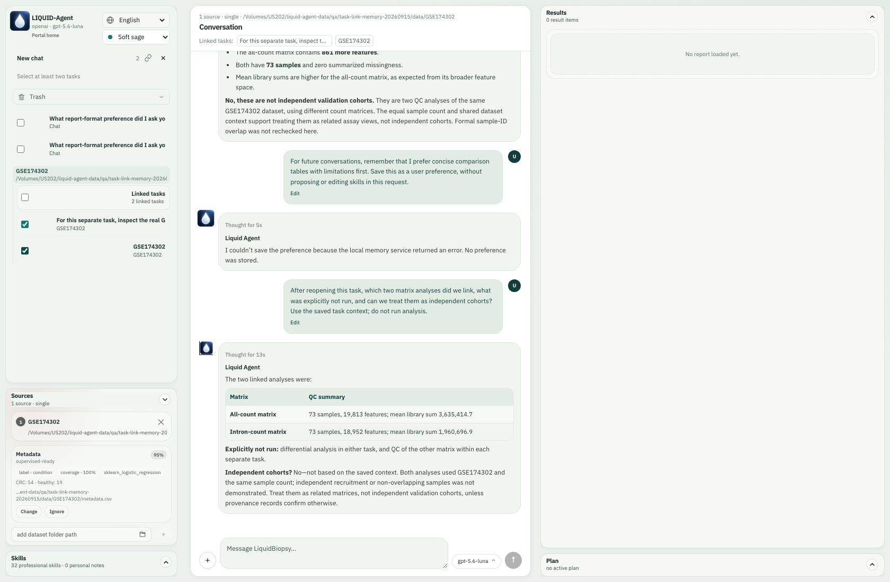
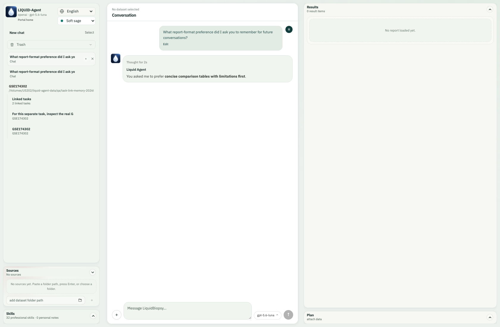

[English](#english) | [简体中文](#chinese)

# Linked Tasks and Local Memory

Link completed conversations when you want to compare their findings, reconcile
contradictions, or prepare a new joint question. A link preserves evidence from
selected tasks; it does not pool datasets or authorize another analysis.

## Select, link, and ask

1. Beside **New chat**, click the small **Select** button. Checkboxes appear on task rows.
2. Select **two or more** tasks. The control becomes a chain icon. The small **×** cancels selection. Running tasks are temporarily unavailable for linking.
3. Click the chain. The workspace opens a new **Linked tasks** conversation and clears selection. Progress appears through the normal conversation status messages.
4. The agent reads each selected task's context and result inventory, writes a separate handoff, then writes a combined memory. It announces readiness only after those files are saved. If preparation fails or is interrupted, ask it to continue; already saved work is retained.
5. Ask a combined question. Small source-task buttons below the conversation heading reopen the original tasks. A source in Trash is unavailable until restored.

Up to 32 tasks can be linked at once. For larger projects, an earlier synthesis
can be included in another link. Nested syntheses are not independent evidence.

## Real example: two GSE174302 QC tasks

The real API-backed example used separate intron-count and all-count tasks from
the same GSE174302 cohort (54 colorectal-cancer and 19 healthy samples). Each task
ran only its requested matrix QC. The combined question was:

> Considering the two linked QC tasks together, compare their sample and feature counts and mean library sums using the original registered QC outputs. Are these independent validation cohorts? Do not rerun any calculations.

The agent used `read_linked_result` to inspect original numeric QC summaries.
It reported 73 samples in each matrix, 19,813 versus 18,952 features, and mean
library sums of approximately 3,635,414.7 versus 1,960,696.9. It correctly kept
these as two views of the same cohort, not independent validation. No QC or
differential analysis was rerun for the combined question.

Result references remain tied to their source task and capture time. If an
original result changes or disappears, the read fails explicitly rather than
silently substituting another file. Handoffs remain available after a source is
deleted, but they do not make missing numerical results available. Creating a
fresh link captures later task updates.

New computations still require a user request and suitable installed tools.
Source datasets are attached to the new task when available; its generated
outputs are separate. Prior outputs are **not automatically copied into the new
analysis workspace**, and linking does not make every cross-study computation
supported. The agent must inspect prerequisites and explain any unsupported
comparison instead of rerunning prerequisites without permission.

Linked conversations use the same **Results** panel as ordinary tasks. Brief
results, clarifications and the initial ready message can stay in chat. The agent
judges whether length, complexity, visual material or lasting summary value warrant
a report in Results, using the same standard for ordinary and linked tasks.
There is no rigid word threshold or mandatory report for every comparison.
Explicit report requests are honored; published reports have a short chat summary.
New supported analyses register their tables and figures normally. A report
based on verified parent aggregates does not require rerunning those analyses;
parent figures are not automatically copied or embedded. An empty Results panel
after initial linking means no new report has been published yet, not that
linked tasks cannot produce results.

## Two different kinds of memory

### Context compaction and handoffs

The GPT runtime's automatic context compaction and a task handoff serve different
purposes. Compaction keeps a conversation within the model's context budget;
handoffs preserve source-specific evidence for another task. There is no exposed
force-compaction tool for the skills to call.

The existing memory tools support proactive consolidation: read one source's
paged context and inventory, reconcile its saved summary with corrections,
retrieve relevant older checkpoints, and save its concise JSON/Markdown handoff
before processing the next source. Synthesis uses these saved handoffs instead
of concatenating every full transcript. Long work can save provisional progress
and resume after interruption or automatic compaction. A provisional summary
does not mark the link ready. Summaries are not lossless; result references,
constraints, uncertainty and unfinished work must survive, and numerical claims
can still require reading original results. No additional compression skill is
needed.

| Memory | Content | Default location |
| --- | --- | --- |
| User | Explicit background, expertise, language, reporting and workflow preferences, with a quote of the user's instruction | Installation-selected personal-information directory: `memory/preferences.sqlite3` |
| Task | Goals, findings, decisions, corrections, completed/failed work, limitations, unresolved questions, safe context checkpoints, compact events and linked handoffs | Task-owned generated-data folder: `memory/<creation-timestamp>/` |

The user-memory directory follows the personal-information storage location the
user selects during installation. It is separate from research dataset paths and
from the code installation, so attaching a data disk or upgrading Python/npm does
not redirect or overwrite it. Older installations without an explicit selected
location retain their normal per-user application configuration directory on
macOS, Windows or Linux. `LIQUID_AGENT_USER_MEMORY_ROOT` explicitly overrides
this location for managed or customized deployments. This directory is excluded
from Git and package data.

Task folders use the existing conversation-owned output root, normally on the
configured data disk under `.liquid-agent/conversations/<task-hash>/`. They are
separate from raw input datasets, including when several tasks share one dataset
or a task has no dataset. The timestamp is the task's creation time, so resuming
it does not create a different memory folder. `memory.json` holds structured
state; `memory.md` is the readable LLM summary. `checkpoints/` retains safe earlier
context beyond the provider's rolling window. `events/` retains compact state changes
and tool facts, never hidden reasoning. A linked task also has `links.json`
and individual JSON/Markdown files under `handoffs/`.

Task state is checkpointed locally after turns; the LLM maintains the concise
summary after meaningful decisions or findings. Older tasks are backfilled from
retained runtime state when linked or next used. History already lost before
this upgrade cannot be reconstructed. Memory is fallible context, not a new
instruction hierarchy: current user instructions take precedence over stored
preferences or old task instructions.

For example:

> For future conversations, remember that I prefer concise comparison tables with limitations first. Save this as a user preference, without proposing or editing skills in this request.

A new conversation can retrieve this preference. “For this report only” belongs
in task memory instead. The memory curator reuses the same stable key when the
user says a preference or background has changed, retaining the old revision as
superseded. Adaptive habits can expire; after their source task is permanently
deleted they become orphaned and fade on an accelerated schedule. Explicit durable
preferences survive deletion until corrected or forgotten. User memory does not
store datasets, patient records, API keys or inferred sensitive attributes.
Remembering a preference does not silently accept a proposed skill modification;
skill changes retain their separate accept/refuse workflow. This maintenance is
deliberately unobtrusive and does not add a separate memory-management panel.

The curator saves a safe statement when the user explicitly asks, or when the
user's own words clearly describe stable, cross-task context that will change a
future interaction. One-off, inferred and dataset-specific details remain in the
task. Unconfirmed adaptive memories lose retrieval weight gradually before final
expiry. At meaningful task boundaries, related context is consolidated in time
bands: recent items remain precise, older items become monthly, quarterly and
eventually yearly semantic summaries. Active durable preferences remain exact,
and conflicting contexts are never flattened into a false compromise.

## Trash, restore and permanent deletion

- Moving a task to Trash moves its entire owned output tree, including memory,
  intermediate files and handoffs. Restore puts it back at its original location.
- Permanent deletion removes that task's memory, generated files and private
  runtime history. Original datasets and other tasks remain intact.
- A linked task owns its independent handoff snapshot. Deleting a parent does not
  erase this separately created snapshot; delete the linked task as well if you
  want its copy removed. It cannot read a trashed or permanently deleted parent's
  result files. Adaptive user habits supported only by a purged task gradually
  expire; explicit durable user preferences remain until corrected or forgotten.

No additional database service is required. User preferences use embedded SQLite;
task ownership, plans, results and memory continue to use the existing task index,
atomic files and runtime checkpoints, avoiding competing deletion indexes.

## CLI and skills

In `liquid-agent cli`, use `/conversations` to list active task IDs, then
`/link <task-id> <task-id> [...]`. The CLI opens a new synthesis context through the
same controller and tools. `/memory` displays the current task summary and the
local memory locations. You can also ask to remember, recall or forget a durable
preference in ordinary language.

Four maintained skills support this workflow:

- `memory-curation`: multi-level scope, updates, conflicts and natural ageing.
- `task-handoff`: source-specific context, evidence and unfinished work.
- `linked-task-synthesis`: integrated interpretation, disagreements and scope.
- `task-memory`: ongoing task state and explicit reusable user preferences.

<!-- BEGIN CHINESE TRANSLATION -->

---

# 链接任务与本地记忆

当你希望对照多个任务的结果、厘清矛盾或提出新的综合问题时，可以链接任务。
链接会保留所选任务的证据快照，不会自动合并数据集或执行新的分析。

## 选择、链接、综合提问

1. 点击 **New chat／新对话** 右侧小巧的 **选择**，任务行左侧出现复选框。
2. 选中至少两个任务，按钮变为锁链图标。旁边的小 **×** 可取消；运行中的任务需要先结束。
3. 点击锁链，自动进入新的 **综合对话**，复选框消失，正常显示准备进展。
4. 智能体分别读取各任务的上下文和结果清单，写出每份交接摘要，再保存综合记忆。
   这些步骤成功后才会提示准备好了。失败或中断后，可要求继续准备，不会丢弃已保存的交接内容。
5. 开始综合提问。对话标题下的小型来源按钮可返回原任务；原任务在垃圾箱中时需先恢复。

一次最多链接 32 个任务。更大的项目可以把此前的综合对话再参与链接，但不能把嵌套引用当成独立证据。

## 真实示例：GSE174302 的两个质控任务

这次截图来自真实数据、真实 API 调用：同中心 54 个结直肠癌与 19 个健康样本，
分别在两个任务中对 intron-count 和 all-count 矩阵执行质控。综合提问要求：
“根据原始质控结果，比较样本数、特征数和平均文库计数；这是否属于独立验证队列？不要重算。”

智能体通过 `read_linked_result` 读取原任务中登记的数值汇总，得到两组均为 73 个样本，
特征数分别为 19,813 和 18,952，平均文库计数约为 3,635,414.7 与 1,960,696.9。
它指出这只是同一队列的不同矩阵，不能当作独立验证；没有重跑质控或差异分析。

每个结果引用都保留来源和快照时间。原文件变化或消失后会明确报错，不会悄悄换文件。
原任务删除后，交接快照仍在，但不能因此读取已经不存在的数值结果。重新链接可获得较新的任务快照。

新计算仍需要用户指令及实际可用的工具。可用的来源数据集会附加到综合任务，生成结果则独立存储。
**链接不会自动把原任务的全部结果复制进新分析工作区**，也不代表支持任意跨研究统计方法。
智能体必须核对计算前提，说明限制，不得未经允许重跑前置计算。

综合任务与普通任务使用相同的 **Results／结果栏**。简短结果、解释和初始准备完成提示可以留在对话中。
智能体根据长度、复杂程度、图表展示需求和总结留存价值，自行判断是否发布到 Results，两类任务使用同一标准。
不设机械的字数门槛，也不要求每次比较都生成报告；用户明确要求报告时会遵循，并在对话中提供简短摘要。
新执行的受支持分析照常登记表格和图。根据核验过的原任务汇总发布报告不需要重跑分析，
原任务的图片也不会自动复制或嵌入。刚完成链接时 Results 为空，表示尚未发布新报告，
并不表示综合任务不能产生结果。

## 用户记忆与任务记忆

### 上下文压缩与交接文档

GPT 运行层的自动上下文压缩用于控制单次对话的上下文长度；交接文档用于向另一个任务传递
有来源依据的信息，两者用途不同。目前没有开放给 skills 主动调用的“强制压缩”工具。

已有记忆工具支持主动整理：逐个读取来源任务的分页上下文与结果清单，用较新的修正核对已有摘要，
按需查阅较早检查点，再立即保存该任务的精简 JSON／Markdown 交接文档，随后处理下一个任务。
综合总结复用这些交接文档，不把所有完整对话一次性塞进上下文。长任务可以保存未完成的进度摘要，
在中断或自动压缩后读取并继续；进度摘要不会把链接标记为准备完成。
摘要不是无损压缩，必须保留结果引用、约束、不确定性和未完成事项，具体数值仍可追溯原始结果。
这个流程不需要额外增加一个压缩 skill。

| 类型 | 内容 | 默认位置 |
| --- | --- | --- |
| 用户记忆 | 用户明确表达的背景、专业程度、语言、报告及工作方式偏好，并保留原话依据 | 安装时选择的个人信息存储目录下 `memory/preferences.sqlite3` |
| 任务记忆 | 目标、发现、决定、更正、已完成/失败工作、局限、未解决问题、上下文检查点、精简事件和交接快照 | 任务专属生成数据目录下 `memory/<创建时间戳>/` |

用户记忆跟随安装时选择的个人信息存储目录，与研究数据集路径和代码安装目录相互独立；
挂载数据盘或升级 Python／npm 包都不会把它改写到别处。没有显式选择目录的旧安装继续使用
macOS、Windows 或 Linux 各自标准的用户级应用配置目录。托管或自定义部署可用
`LIQUID_AGENT_USER_MEMORY_ROOT` 明确改写位置；该目录排除在 Git 和安装包数据之外。

任务记忆沿用既有任务输出目录，默认在数据盘的 `.liquid-agent/conversations/<任务哈希>/` 下，
不写入原始输入数据集。多个任务共用数据集、多个数据集参与一个任务、纯聊天任务，都各自独立。
时间戳固定为任务创建时间，恢复任务不会新建另一套记忆。`memory.json` 保存结构化状态，
`memory.md` 保存易读摘要，`checkpoints/` 保存较早的安全上下文，`events/` 保存状态变化及工具事实而不记录隐藏思维；综合任务还包含 `links.json`
和 `handoffs/` 中每个来源的 JSON／Markdown 文件。

系统在对话结束后保存任务状态，LLM 在有实际决定或发现时维护简洁摘要。
旧任务在再次使用或参与链接时，从仍保留的运行状态补建记忆；升级前已丢失的历史不能凭空恢复。
记忆只是可能有误的上下文，不是新的指令优先级，用户当前指令始终优先。

例如：“以后都请用精简对比表格，先讲局限。保存为用户偏好，这次不要修改 skills。”
新对话就能取用该偏好。如果仅要求“这份报告这样写”，则只属于任务记忆。用户说明背景或偏好发生变化时，
记忆维护器复用同一稳定键并将旧版本标记为已取代。自适应习惯可以过期；其唯一来源任务被彻底删除后会成为孤立记忆并加速淡出。
明确的长期偏好不会仅因来源任务删除而丢失，而是在用户更正或要求忘记时更新。用户记忆不存数据集、患者记录、API Key
或推测出的敏感属性；保存偏好不会绕过技能修改的接受／拒绝审阅。维护过程不增加单独的记忆管理界面。

维护器会保存用户明确要求记住的安全内容；没有直接要求时，只有用户亲自表达、能够跨任务复用，
并且会真实改变今后交互方式的稳定背景或偏好才进入用户记忆。一次性、推断得出和数据集专属内容
仍留在任务内。长期没有得到确认的自适应记忆会先逐步降低检索权重，再最终过期；在有意义的任务
边界，相关旧上下文会按时间层次整理：近期保持精确，更久远的内容依次形成月度、季度及年度语义
概括。当前有效的长期偏好保持原文语义，互相冲突的情境不会被强行合并。

## 垃圾箱与文件生命周期

移入垃圾箱时，任务专属输出目录会整体移动，包括记忆、中间文件和交接文件；恢复时移回原处。
彻底删除会移除该任务的记忆、生成文件和运行历史，保留原始数据集和其他任务。

综合任务拥有自己的交接快照。删除原任务不会删除这份另行生成的快照；若希望同时清除它，
还需要删除综合任务。综合任务不能读取已入垃圾箱或已彻底删除的原任务结果。只由已彻底删除任务支持的自适应习惯会逐渐过期；
明确的长期用户偏好在更正或要求忘记前继续有效。

无需安装额外数据库服务：用户偏好使用内嵌 SQLite，任务、计划、结果及记忆沿用既有索引、原子文件和运行检查点。

## CLI 与通用 Skills

`liquid-agent cli` 中，`/conversations` 列出任务 ID，`/link <任务ID> <任务ID> [...]` 创建综合上下文，
走与网页相同的控制器和工具。`/memory` 显示当前任务摘要及记忆文件位置。
也可用普通语言要求记住、回忆或忘记长期偏好。

四个维护中的技能共同负责：`memory-curation`（多层级作用域、更新、冲突与自然淡出）、
`task-handoff`（单任务交接）、`linked-task-synthesis`（融合判断）及 `task-memory`（任务状态与用户偏好）。

## Matched RNA analysis across linked tasks

When two completed tasks analysed alternative RNA count definitions for the **same samples**, you can ask:

> Compare the two count definitions: check matched sample profiles, differential-effect direction and FDR overlap. Reuse the completed fits and publish an illustrated report with the new comparison figures and limitations.

The shared CLI/Web tool verifies the linked input snapshots, sample IDs, metadata, contrast direction and model design before computing. It produces paired sample agreement, a cross-sample correlation heatmap, an effect comparison and a significance-overlap figure. Missing adjusted P-values are excluded from the common finite test universe; they are not counted as nonsignificant. The new figures, tables and report belong to the linked task's Results. Parent analyses are neither modified nor refitted.

Both parents must have completed compatible RNA differential analyses when the link is created. An old or changed snapshot needs a fresh link. Different cohorts or designs cannot be silently pooled. This is a same-cohort robustness comparison, not external validation, and original fitting warnings still apply.
