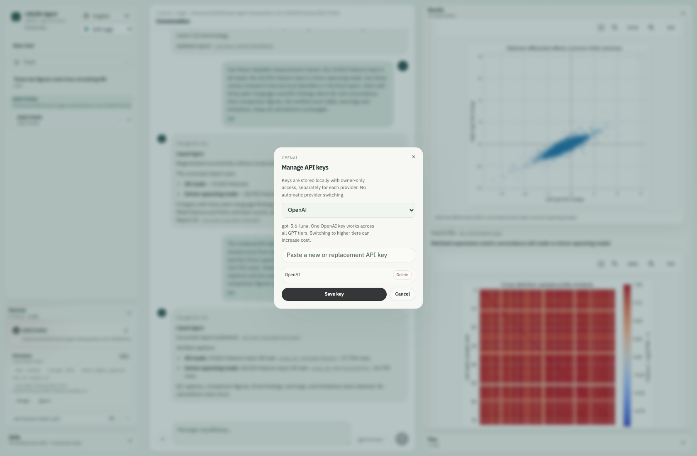

<a id="english"></a>

[English](#english) | [简体中文](#chinese)

# OpenAI GPT Configuration

Liquid Agent defaults to the **OpenAI GPT API**, through the Responses API at
`https://api.openai.com/v1`. Web and CLI share the Codex conversation controller,
credential/model policy, and LangGraph scientific execution layer. Direct SDK
requests remain available to internal services and explicit legacy diagnostics.
Changing models does not replace liquid-biopsy knowledge, skills,
dataset context, tool checks, cancellation, or user review between steps.

In the same conversation, switching GPT models, providers or local profiles keeps
the safe conversation context, attachments, current plan, completed results and
task memory. Earlier relevant decisions can be retrieved from task checkpoints
when they fall outside the model's recent context. This is retained task evidence,
not a promise that every old message fits verbatim in every model's prompt. Real
history edits invalidate superseded context; provider privacy rules still apply.

For explicit on-device inference, see [Local Language Models](local-models.md).
Local profiles keep their endpoint/authentication separate from these cloud settings.

## Model Selection

The reviewed catalog lives in `agent/openai_models.py`. As of 4 October 2026:

| Web model name | Selection | Policy |
| --- | --- | --- |
| GPT-6.1 Sol | `gpt-6.1-sol` | Explicit GPT-6.1 Sol choice |
| GPT-6 Astra | `gpt-6-astra` | Explicit flagship choice; higher token prices |
| GPT-6 Sol | `gpt-6-sol` | Explicit higher-capability choice for complex agentic work |
| GPT-6 Luna | `auto` | Existing economical default; unchanged by this catalog update |
| GPT-5.6 Sol | `gpt-5.6-sol` | Explicit GPT-5.6 Sol choice |
| GPT-5.6 Terra | `gpt-5.6-terra` | Explicit GPT-5.6 Terra choice |
| GPT-5.6 Luna | `gpt-5.6-luna` | Explicit GPT-5.6 Luna choice |

The Web menu shows each model name in bold with its key status on the same line, separated by a small grey divider, without tier headings. An unconfigured key is shown in red. Its GPT order is **GPT-6.1 Sol**, **GPT-6 Astra**, **GPT-6 Sol**, **GPT-6 Luna**, **GPT-5.6 Sol**, **GPT-5.6 Terra**, **GPT-5.6 Luna**. The GPT-6 Luna entry selects `auto`; menu order does not change the default.

The catalog includes the existing GPT-6 choices alongside GPT-5.6 Luna, Terra,
Sol and GPT-6.1 Sol. `auto` still resolves to `gpt-6-luna`; all other entries are
opt-in and use the same OpenAI key. Existing explicit pins, including an older
GPT model ID, are not silently rewritten. Tool-capable agent turns run through
the Responses API. Requests use low reasoning effort and omit unsupported
sampling parameters. A menu entry does not grant account access or prove that a
particular key can call the model. Account access and pricing can change.
The authoritative references are the [model catalog](https://developers.openai.com/api/docs/models),
[pricing](https://developers.openai.com/api/docs/pricing), and
[latest-model guide](https://developers.openai.com/api/docs/guides/latest-model).
The added IDs are documented in the official [GPT-5.6 Luna](https://developers.openai.com/api/docs/models/gpt-5.6-luna),
[GPT-5.6 Terra](https://developers.openai.com/api/docs/models/gpt-5.6-terra),
[GPT-5.6 Sol](https://developers.openai.com/api/docs/models/gpt-5.6-sol), and
[GPT-6.1 Sol](https://developers.openai.com/api/docs/models/gpt-6.1-sol) pages.

The Web picker obtains its catalog from `/api/llm/config`; it does not carry a
second list of model IDs. The CLI also accepts a pinned `gpt-*` model ID.
Saved explicit choices remain unchanged when the economical catalog is updated.
Catalog and adapter updates take effect after restarting the local service;
running analyses are not hot-swapped to a different implementation mid-task.
If a model is unavailable, the application reports the error. It never silently
switches providers or upgrades to a more expensive model.

A new model release does not necessarily require an API adapter rewrite. When
the endpoint and supported request parameters remain compatible, the change
can be limited to the reviewed selection catalog; the CLI already accepts
explicit `gpt-*` IDs. Endpoint or parameter changes, SDK incompatibilities and
model deprecations require a targeted compatibility review and, when necessary,
adapter changes. The application does not automatically discover or select new
models at runtime. Updating the catalog does not change `auto` or saved pins.

```text
/llm models
/llm key
/llm use auto
/llm save
```

For an explicit higher tier:

```text
/llm use gpt-6-astra
/llm save
```

`liquid-agent llm-configure` provides interactive setup. Prefer its hidden key
prompt or `OPENAI_API_KEY` over putting a secret in a command-line argument.

The model choices scroll separately from **Manage local models** and **Manage keys**, which remain visible at the bottom of the menu. The Gemini display name is **Gemini-3.8-Flash**; its API model ID remains `gemini-3.8-flash`.

## Optional Gemini

The supported Gemini option is `gemini-3.8-flash`. Google lists free
standard-API input/output tokens and
support for function calling and structured outputs. Its agent-workflow
capabilities make it our preferred free-tier candidate, based on the official
[model description](https://ai.google.dev/gemini-api/docs/models/gemini-3.8-flash),
not a local model benchmark. This is **not a guaranteed-free model switch**: the Google
project's billing tier, eligibility and current quotas determine access and charges.
Check [pricing](https://ai.google.dev/gemini-api/docs/pricing) and your limits in
[Google AI Studio](https://aistudio.google.com/api-keys). Do not enable billing
just to follow this tutorial.

For Free Tier use, create or select a separate Google project whose Billing
Tier in [AI Studio](https://aistudio.google.com/projects) is **Free Tier**, with
billing disabled, and use that project's Gemini key. Keep billing disabled; do
not enable paid billing or auto-reload to resolve a quota error. A saved model
choice cannot inspect or enforce Google billing. This is separate from your
OpenAI key. Quota errors stop the request without a paid fallback; free capacity
and continued availability are not guaranteed. See [Google billing](https://ai.google.dev/gemini-api/docs/billing).

Use public or non-sensitive synthetic data only. Unpaid prompts and responses may be used
to improve Google products. Google's [terms](https://ai.google.dev/gemini-api/terms)
include regional restrictions and paid-service requirements for API clients in
the EEA, Switzerland and UK. The local privacy gateway remains active, but an
aggregate summary is not automatically suitable for external disclosure.

In Web, select **gemini-3.8-flash** from the composer model menu,
read the notice and enter a Gemini API key. **Manage keys** has a provider selector
for adding/replacing each provider's key independently. Deleting one provider's
key does not delete the other. Configuration does not verify Google billing or
prove that the key works; the next request reports actual API errors.

The Web menu shows one Gemini entry. Previously saved `gemini-3.5-flash-lite` selections remain pinned; key management preserves them, but the older model is no longer a separate Web menu item.
Choose the recommended model explicitly to upgrade; existing keys are retained.
With no Gemini model selected, `/llm use gemini` resolves to `gemini-3.8-flash`.
OpenAI remains the product default.

In the terminal shell:

```text
/llm key gemini
/llm use gemini
/llm save
```

Alternatively, run `liquid-agent llm-configure --llm-provider gemini` for a
hidden key prompt, or set `GEMINI_API_KEY` (`GOOGLE_API_KEY` is also recognized).
Use `/llm use auto` to return explicitly to GPT, and `/llm delete gemini` to
remove the Gemini key and block environment-key reactivation.

Gemini uses a native function-calling adapter, not the Codex Responses transport.
It shares the same conversation controller, skills, privacy gateway, validated
local tools, LangGraph jobs and report/history ownership. It does not implement
a separate fixed workflow. Native tool-call signatures remain in the local
conversation transcript for continuation. Stop cancels the active request without
closing the Web service. Quota/authentication failures are reported, with no
automatic retries, provider fallback, billing activation or model upgrade.

## Credentials and Migration

Use **Manage keys** in the Web model menu to add, replace, or delete the OpenAI
key. One key serves every GPT tier. Empty input on a model change keeps the saved
key. A rejected configuration does not close the dialog or pretend it succeeded.
Saving a key stores it; it does not prove that OpenAI accepts it or that the
account has credit. Request errors are shown when calling the API.

Configuration is stored in `llm_config.json` in the OS user configuration folder:

- macOS: `~/Library/Application Support/liquidbiopsy_agent/`
- Linux: `~/.config/liquidbiopsy_agent/`
- Windows: `%LOCALAPPDATA%/liquidbiopsy_agent/`

Writes use a private temporary file, an atomic replacement, and owner-only file
permissions on POSIX. Saved keys use **authenticated Fernet encryption**. The master key stays in the native OS credential store; a locked or unavailable store fails closed. Protect your user account and backups. API responses to the UI contain key-presence flags, never
the saved secret. Keys are not stored in browser persistence or graph checkpoints.
`LIQUIDBIOPSY_CONFIG_DIR` overrides the configuration folder for both CLI and
Web, including a directory on a data disk. Choose a private directory outside
the source checkout and any Git repository. For example, on macOS:

```bash
export LIQUIDBIOPSY_CONFIG_DIR="/Volumes/YourDataDisk/liquid-agent-private/config"
liquid-agent web
```

Use the same environment setting when launching `liquid-agent` in the terminal.
Keys entered afterward are saved in that directory's `llm_config.json`. Setting
this variable does not move or delete existing credentials; an empty destination
requires entering the key again. Keep the disk mounted when using this setting.
The default remains the OS user configuration folder outside the source checkout.
Local `.env` files and `llm_config.json` are also excluded by Git ignore rules;
these rules do not remove files already committed to Git history.

Legacy configuration is migrated on read. Pre-version-3 credentials removed by
the OpenAI-only migration are not revived. New version-3 configurations retain
independent OpenAI and explicitly added Gemini entries; unsupported providers,
proxy endpoints and local-model paths are removed. Existing pinned GPT IDs remain pinned. Select
`auto` to adopt the economical default. Generic legacy API-key and base-URL
environment variables are ignored, preventing accidental cross-provider routing.

The launcher preserves a caller-supplied `OPENAI_API_KEY` across Conda activation,
so a stale Conda environment variable cannot replace it. Saved OpenAI settings
still take precedence over environment keys. Regenerate installed command shims
with the installer after upgrading if they predate this launch-environment fix.

Deleting the key disables subsequent requests, including from existing client
objects. It also records that `OPENAI_API_KEY` must not be silently reactivated.
Add a new key to re-enable access. This does not remove the variable from your
shell. It also cannot recall a request already sent to OpenAI. Model changes
affect the selected session and the default for new sessions, not other active
sessions' explicit model choices.

## Requests and Failure Handling

The direct Python SDK adapter uses low reasoning effort for GPT-5 and GPT-6 requests.
Its default output budget is 2,400 tokens, including reasoning; incomplete output
is rejected instead of being dispatched as a partial tool decision. Optional
`LIQUIDBIOPSY_LLM_MAX_TOKENS` and `LIQUIDBIOPSY_LLM_TIMEOUT` settings adjust the
budget and per-request timeout. Transient failures get one same-model retry by
default, then a short cooldown. Authentication failures are not retried against
another model or provider.

The direct SDK adapter sets `store=false`; Liquid Agent supplies its local
conversation and domain context explicitly. This flag does not promise zero
retention by OpenAI.
Review [OpenAI data controls](https://developers.openai.com/api/docs/guides/your-data)
before sending sensitive research data. The existing local scientific tools still
process data locally; model prompts can contain the user's questions, dataset
metadata, selected summaries, and retrieved project/skill context.

The Codex conversation runtime manages its own multi-turn
Responses requests. It uses the same configured API key/model and low reasoning
effort, but the SDK adapter's `LIQUIDBIOPSY_LLM_MAX_TOKENS`, timeout, cooldown,
and `store=false` implementation must not be assumed to govern Codex requests.
Codex has separate turn/tool-call limits and keeps local conversation state.
Verify the deployed Codex version and OpenAI account data controls before sending
sensitive research information; this integration does not certify zero retention.

Offline diagnostics remain available through `/llm off`. Any deterministic
recovery information is not a successful live GPT answer.

## Key-management entry in the live workspace

Open the model selector beside the composer, then **Manage keys**. The example below shows an empty input so no credential is visible.

[](../assets/current-workspace/12-key-manager.png)

The real key-management dialog; credentials are not visible.
<!-- BEGIN CHINESE TRANSLATION -->

---

<a id="chinese"></a>

# OpenAI GPT 配置（中文）

Liquid Agent **默认使用 OpenAI GPT API**，通过 `https://api.openai.com/v1` 的 Responses API 调用。Web 和 CLI 共用 Codex 对话控制器、凭据/模型策略及 LangGraph 科学执行层。内部服务与显式既有诊断仍可直接使用 SDK 请求。更换模型不会替代液体活检知识、skills、数据集上下文、工具检查、取消或步骤之间的用户审阅。

在同一对话内切换 GPT 型号、提供方或本地配置，会保留安全对话上下文、附件、当前计划、已完成结果和任务记忆。较早的相关决定超出模型近期上下文时，可以从任务检查点检索。这表示任务证据得到保留，并不承诺每个模型都能在提示中逐字容纳全部历史。真正修改历史会使过时上下文失效；提供方的隐私规则仍然适用。

## 模型选择

审查后的目录位于 `agent/openai_models.py`。截至 2026 年 10 月 4 日：

| Web 模型名称 | 选择方式 | 策略 |
| --- | --- | --- |
| GPT-6.1 Sol | `gpt-6.1-sol` | 显式选择 GPT-6.1 Sol |
| GPT-6 Astra | `gpt-6-astra` | 显式选择的旗舰型号，Token 单价更高 |
| GPT-6 Sol | `gpt-6-sol` | 适合复杂智能体任务、需显式选择的更高能力档位 |
| GPT-6 Luna | `auto` | 原有经济型默认值；本次目录更新不改变它 |
| GPT-5.6 Sol | `gpt-5.6-sol` | 显式选择 GPT-5.6 Sol |
| GPT-5.6 Terra | `gpt-5.6-terra` | 显式选择 GPT-5.6 Terra |
| GPT-5.6 Luna | `gpt-5.6-luna` | 显式选择 GPT-5.6 Luna |

Web 菜单仅显示加粗的模型名称及同一行的密钥状态，中间以灰色细竖线分隔，不显示档位标题。未配置密钥时，状态以红色显示。GPT 排序为 **GPT-6.1 Sol**、**GPT-6 Astra**、**GPT-6 Sol**、**GPT-6 Luna**、**GPT-5.6 Sol**、**GPT-5.6 Terra**、**GPT-5.6 Luna**。GPT-6 Luna 入口使用 `auto` 选择；菜单顺序不改变默认型号。

目录保留既有 GPT-6 选项，并加入 GPT-5.6 Luna、Terra、Sol 和 GPT-6.1 Sol。`auto` 仍解析为 `gpt-6-luna`；其他入口需手动选择，并使用同一 OpenAI 密钥。已有显式固定型号（包括较旧 GPT ID）不会被静默改写。工具型智能体请求均通过 Responses API；请求使用 low 推理强度，不发送不支持的采样参数。菜单中出现型号不代表账户获得访问权限，也不证明某个密钥可以调用该型号。账户访问权限与价格可能变化。权威参考是[模型目录](https://developers.openai.com/api/docs/models)、[价格](https://developers.openai.com/api/docs/pricing)、[最新模型指南](https://developers.openai.com/api/docs/guides/latest-model)和[更新日志](https://developers.openai.com/api/docs/changelog)。新增 ID 见官方 [GPT-5.6 Luna](https://developers.openai.com/api/docs/models/gpt-5.6-luna)、[GPT-5.6 Terra](https://developers.openai.com/api/docs/models/gpt-5.6-terra)、[GPT-5.6 Sol](https://developers.openai.com/api/docs/models/gpt-5.6-sol) 与 [GPT-6.1 Sol](https://developers.openai.com/api/docs/models/gpt-6.1-sol) 页面。

Web 选择器从 `/api/llm/config` 获取目录，不另存第二份模型 ID 列表。CLI 也接受固定的 `gpt-*` 模型 ID。经济目录更新时，已保存的显式选择不变。目录和适配器更新在重启本地服务后生效；不会在分析途中热切换实现。模型不可用时，应用报告错误，绝不静默切换提供商或升级到更昂贵模型。

新模型发布不一定需要重写 API 适配器。端点及支持的请求参数兼容时，通常只需更新审查后的选择目录；CLI 已接受显式 `gpt-*` ID。端点或参数变化、SDK 不兼容及模型弃用需要有针对性的兼容审查，必要时修改适配器。应用不会在运行时自动发现或选择新模型；更新目录不会改变 `auto` 或已保存的固定型号。

```text
/llm models
/llm key
/llm use auto
/llm save
```

显式选择更高档位：

```text
/llm use gpt-6-astra
/llm save
```

`liquid-agent llm-configure` 提供交互式设置。优先使用隐藏密钥输入或 `OPENAI_API_KEY`，不要将密钥放在命令行参数中。

型号选项可单独滚动，**Manage local models** 与 **Manage keys** 管理入口始终显示在菜单底部。Gemini 的界面名称为 **Gemini-3.8-Flash**；API 模型 ID 仍为 `gemini-3.8-flash`。

## 可选 Gemini

支持的 Gemini 选项为 `gemini-3.8-flash`。官方列明标准 API 的输入、输出有免费层，支持函数调用和结构化输出。根据其面向 Agent 工作流的[官方能力说明](https://ai.google.dev/gemini-api/docs/models/gemini-3.8-flash)，我们将其选为优先免费层候选；这不是本项目的模型性能排名。这**不是保证免费的模型开关**。能否使用及是否收费取决于 Google 项目的套餐、资格和当前配额。请先检查[定价](https://ai.google.dev/gemini-api/docs/pricing)及 [Google AI Studio](https://aistudio.google.com/api-keys) 中的限制，不要仅为了跟随教程而开启计费。

若只允许使用 Free Tier，请在 [AI Studio](https://aistudio.google.com/projects) 新建或选择独立项目，确认 Billing Tier 为 **Free Tier** 且未开通计费，再使用该项目的 Gemini Key。保持计费关闭，不要为解决配额错误而开启付费或自动充值。保存型号无法检查或控制 Google 的计费状态；OpenAI Key 与 Gemini Key 独立。配额错误会停止请求，不转为付费调用；免费容量与持续可用性无法保证。见 [Google 计费说明](https://ai.google.dev/gemini-api/docs/billing)。

仅使用公开或不敏感的合成数据。免费服务的提示和回答可能被用于改进 Google 产品。[Google 条款](https://ai.google.dev/gemini-api/terms) 包含地区限制，以及欧洲经济区、英国和瑞士的 API 客户端付费服务要求。本地隐私网关仍然有效，但汇总信息并不自动意味着适合向外披露。

Web 中，在输入框模型菜单选择 **gemini-3.8-flash**，阅读提示并输入 Gemini API 密钥。**管理 API 密钥**中的服务商选择器可分别添加或替换密钥；删除一家密钥不会删除另一家。保存配置不验证 Google 计费状态，也不证明密钥有效，实际调用时会显示 API 错误。

Web 菜单只显示一个 Gemini 入口。之前保存的 `gemini-3.5-flash-lite` 仍保持固定，管理密钥也会保留该选择，但旧型号不再单独列在 Web 菜单中。升级时请明确选择推荐型号，已有密钥会保留。`/llm use gemini` 默认解析为 `gemini-3.8-flash`；产品默认服务商仍为 OpenAI。

终端 Shell 中：

```text
/llm key gemini
/llm use gemini
/llm save
```

也可运行 `liquid-agent llm-configure --llm-provider gemini`，通过隐藏输入配置密钥，或设置 `GEMINI_API_KEY`（也识别 `GOOGLE_API_KEY`）。`/llm use auto` 显式切回 GPT；`/llm delete gemini` 删除 Gemini 密钥并禁止从环境变量重新启用它。

Gemini 使用原生函数调用适配器，不经过 Codex 的 Responses 通信层；它复用相同的对话控制器、skills、隐私网关、本地工具验证、LangGraph 执行和报告/历史归属机制，不是另造固定流程。原生工具调用签名保留在本地对话记录中，用于续接。停止仅取消当前请求，不关闭 Web 服务。额度或认证失败会直接报错，不自动重试、切换提供商、开启计费或升级模型。

## 凭据与迁移

在 Web 模型菜单中使用 **Manage keys** 添加、替换或删除 OpenAI 密钥。一个密钥服务于所有 GPT 档位。更换模型时留空密钥输入会保留已保存密钥。配置被拒绝时，弹窗不会关闭或假装成功。保存密钥只是存储，不证明 OpenAI 接受它或账户有余额。API 调用时显示请求错误。

配置存储在操作系统用户配置目录中的 `llm_config.json`：

- macOS：`~/Library/Application Support/liquidbiopsy_agent/`
- Linux：`~/.config/liquidbiopsy_agent/`
- Windows：`%LOCALAPPDATA%/liquidbiopsy_agent/`

写入使用私有临时文件、原子替换，以及 POSIX 上仅所有者可访问的文件权限。密钥使用 **Fernet 认证加密**，主密钥保存在操作系统凭据库；凭据库不可用或被锁定时明确报错，不回退到明文。请保护用户账户和备份。返回 UI 的 API 响应只包含密钥存在标记，不包含保存的秘密值。密钥不存于浏览器持久化或图检查点。

CLI 和 Web 都支持通过 `LIQUIDBIOPSY_CONFIG_DIR` 指定配置目录，包括数据盘中的目录。请选择源码目录和任何 Git 仓库之外的私有目录。例如在 macOS 上：

```bash
export LIQUIDBIOPSY_CONFIG_DIR="/Volumes/YourDataDisk/liquid-agent-private/config"
liquid-agent web
```

启动终端 `liquid-agent` 时使用同一个环境变量。此后输入的 Key 会保存到指定目录的 `llm_config.json`。设置变量不会迁移或删除原有凭据；如果目标目录为空，需要重新输入 Key。使用期间需保持数据盘挂载。默认保存位置仍是源码目录之外的操作系统用户配置目录。Git 忽略规则也排除了本地 `.env` 和 `llm_config.json`，但忽略规则无法清除已经提交到 Git 历史的文件。

旧配置在读取时迁移。旧版 OpenAI-only 迁移已移除的凭据不会复活；新版 schema 3 独立保存 OpenAI 和用户新添加的 Gemini 配置，并移除不支持的提供商、代理端点和本地模型路径。已固定的 GPT ID 继续固定。选择 `auto` 采用经济默认值。通用旧 API key 与 base URL 环境变量被忽略，防止意外跨提供商路由。

启动器在 Conda 激活时保留调用者提供的 `OPENAI_API_KEY`，防止陈旧 Conda 环境变量替换它。已保存 OpenAI 设置仍优先于环境密钥。如果已安装命令包装器早于此启动环境修复，升级后用安装程序重新生成。

删除密钥会禁用后续请求，包括来自已有客户端对象的请求，并记录不得静默重新启用 `OPENAI_API_KEY`。添加新密钥可恢复访问。此操作不会从 Shell 移除变量，也无法撤回已发往 OpenAI 的请求。模型变化影响选定会话和新会话默认值，不改变其他活跃会话的显式模型选择。

## 请求与失败处理

直接 Python SDK 适配器对 GPT-5 和 GPT-6 请求使用低推理强度。默认输出预算为 2,400 tokens，包括推理；不完整输出会被拒绝，不会作为部分工具决策分发。可选 `LIQUIDBIOPSY_LLM_MAX_TOKENS` 和 `LIQUIDBIOPSY_LLM_TIMEOUT` 调整预算与每请求超时。瞬时失败默认在同一模型上重试一次，再进入短暂冷却。认证失败不会换模型或提供商重试。

直接 SDK 适配器设置 `store=false`；Liquid Agent 显式提供本地对话和领域上下文。此标记不承诺 OpenAI 零保留。发送敏感研究数据前，应审阅 [OpenAI 数据控制](https://developers.openai.com/api/docs/guides/your-data)。现有本地科学工具仍在本地处理数据；模型提示可能包含用户问题、数据集元数据、选定汇总及检索到的项目/skill 上下文。

Codex 对话运行时管理自己的多轮 Responses 请求，使用相同配置的 API key/模型及低推理强度，但不能假设 SDK 适配器的 `LIQUIDBIOPSY_LLM_MAX_TOKENS`、超时、冷却或 `store=false` 实现同样支配 Codex 请求。Codex 有独立的轮次/工具调用限制，并保留本地对话状态。发送敏感研究信息前，验证部署的 Codex 版本与 OpenAI 账户数据控制；此集成不认证零保留。

`/llm off` 仍提供离线诊断。任何确定性恢复信息都不是成功的实时 GPT 回答。

## 实操工作区中的密钥入口

点击输入框旁的模型选择器，再点 **Manage keys**。下图输入框为空，不会显示任何凭据。

[](../assets/current-workspace/12-key-manager.png)

实际密钥管理弹窗，不显示凭据。
