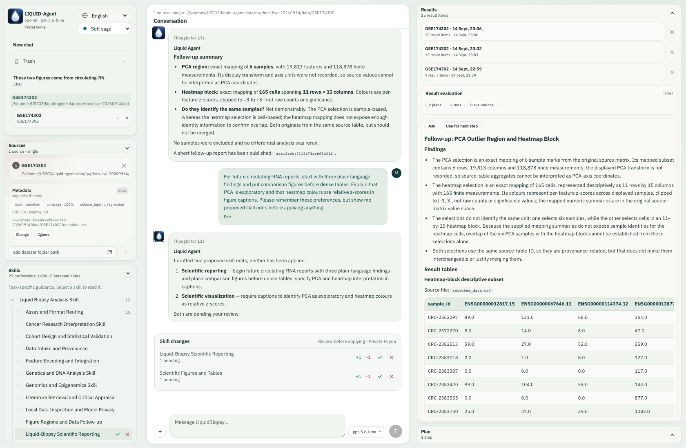
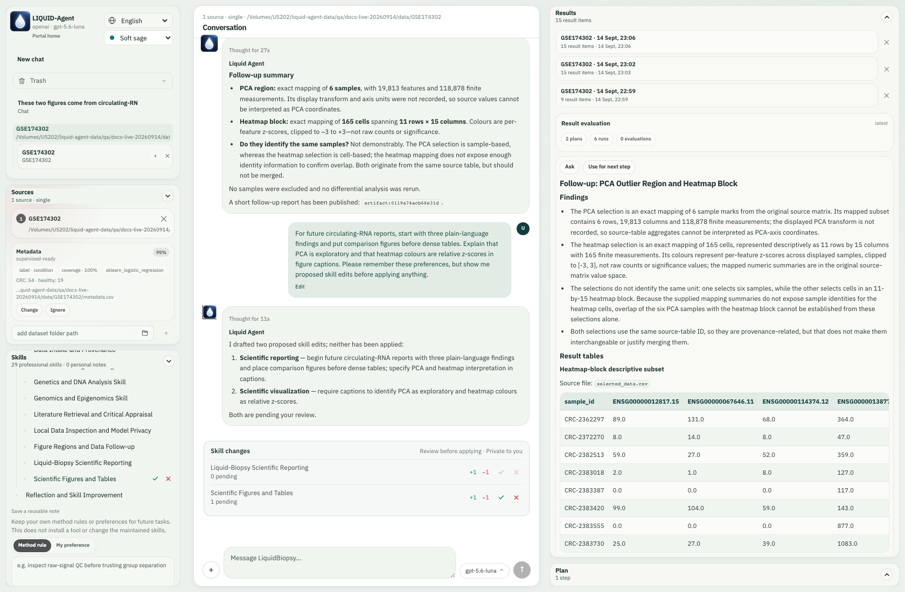
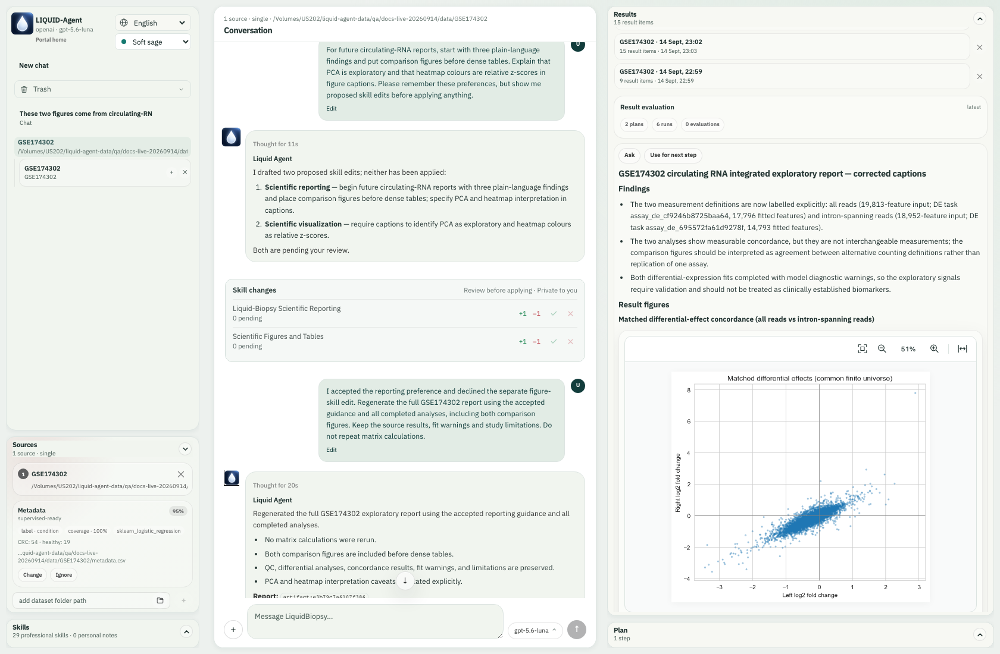

<a id="english"></a>

[English](#english) | [简体中文](#chinese)

# Professional Skill Library

Skills are project functionality, not dataset caches. They guide GPT's scientific
judgement without replacing natural-language interaction or granting execution
permission. Web and CLI share the catalog, full-text loader and validated tools.

See the [34-skill selection guide](../reference/skill-catalog.md) for each
package's motivation, role, selection cues and a natural-language example.
See [explicit assay tables](assay-tables.md) for newly executable processed-table
QC, quantification and the separate RNA count contrast capability.

## Hierarchy and Storage

There are 34 maintained packages, organized physically and logically:

| Project folder | Role | Packages |
| --- | --- | --- |
| `skills/orchestration/` | Intent, evidence, review, memory curation and assay routing | liquid-biopsy-analysis, reflective-learning, memory-curation, assay-routing |
| `skills/shared/` | Reusable scientific methods | local-model-setup, task-memory, task-handoff, linked-task-synthesis, data-intake, local-data-privacy, cohort-design, feature-encoding, result-region-followup, scientific-visualization, scientific-reporting, literature-review, genetics-dna-analysis, genomics-epigenomics, cancer-research |
| `skills/assays/` | Assay-specific guidance | raw-sequencing, genomic-tracks, fragmentomics, ctdna-variants, copy-number, methylation-bisulfite, methylation-enrichment, methylation-arrays, cell-free-rna, small-rna, plasma-proteomics, plasma-metabolomics, extracellular-vesicles, circulating-tumour-cells, digital-pcr |
| Personal-information directory / `skills/` | Locally learned notes and preferences | Private user-created packages |

Each package contains `SKILL.md`; detailed evidence lives in `references/`.
Frontmatter `metadata.parent` defines inheritance. Assay specialists inherit the
assay router and top-level guidance. Shared methods inherit top-level guidance.
Stable skill IDs do not depend on folder tiers. Existing `workflow.yaml` files
remain QC/capability hints, not mandatory end-to-end execution scripts.

User-learned skills live under **`skills/` in the personal-information directory** chosen during installation, independently of research inputs. `liquid-agent skills root` displays the actual location. `LIQUID_AGENT_USER_DATA_DIR` takes priority; without it, `LIQUID_BIOPSY_SKILLS_ROOT` can select a separate library, otherwise the OS configuration directory is used. Earlier project-local libraries are not silently moved or deleted: explicitly import chosen packages. Do not commit private notes.

## How the Agent Uses Skills

1. Receive user intent, conversation context and compact skill metadata.
2. Inspect actual inputs and available computational prerequisites as needed.
3. Select relevant full guidance with `load_skill`, including its ancestors;
   read a listed reference when useful.
4. Answer, clarify, plan or execute an authorized tool according to user intent.
5. Interpret actual results and propose a focused next question from the evidence.

Catalog matching ranks metadata; it does not classify commands or force a fixed
workflow. Capability questions are not permission to execute. Users can ask
off-plan questions or select another supported operation.

Loaded instruction hashes are recorded for provenance. Web's Skills panel shows
the same hierarchy, full instructions and source notes. The legacy
`/skills context` diagnostic shows bounded excerpts; the new GPT controller uses
the full-loading tools instead.

Loading is bounded to five ancestor levels, 20 KB per instruction document and
48 KB per chain. References are text resources inside the selected package,
limited to 32 KB each. Cycles, ambiguous names and path escapes are rejected.
Qualified keys such as `default:genomic-tracks` and `user:genomic-tracks` prevent
a user note from silently shadowing maintained guidance.

## Scientific Coverage and Limits

Guidance covers sequencing QC, tracks, fragmentomics, variants, copy number,
three distinct methylation assay families, RNA, proteins, metabolites, vesicles,
circulating-cell molecular measurements and digital PCR.

**Guidance coverage is not a claim that every assay has an installed end-to-end
analysis engine.** The scientific tool catalog and its readiness checks remain
authoritative. Unsupported operations must identify the missing input, method
or dependency rather than launch an unrelated task.

Core distinctions include:

- BED/bigBed coordinates are not nucleotide sequences. Base-level encoding needs
  a matching reference FASTA/build, and reference bases are not patient alleles.
- Interval widths are not automatically paired-end fragment lengths.
- Enrichment, bisulfite counts and array beta values require different QC;
  enrichment is not a methylation percentage.
- Plasma variants require detection-limit and clonal-haematopoiesis assessment;
  absent evidence is not a measured zero variant fraction.
- Integration preserves patient/replicate identity and prevents data leakage.
  Exploratory plots do not establish clinical discrimination.
- Reports separate measured findings, sampling and limitations. Execution logs
  are not scientific conclusions.

## Literature and Evidence

`search_literature` searches Europe PMC using public biomedical terms, an optional
start date and 1-8 papers. It returns titles, authors, dates, identifiers, links
and available abstracts. Reading is explicitly **abstract-only**, not full text.
Live failure returns an error, not invented citations or silent cached results.
Queries reject local paths, emails and sequence-like strings; never submit
patient identifiers or private data.

This tool is not an exhaustive systematic review. Verify primary methods,
corrections and retractions. Search does not automatically rewrite maintained
skills. User notes and retrieved publications are evidence, never new execution
authority. Each specialist's source notes explain applicability and limitations.

Foundational sources include the [Agent Skills specification](https://agentskills.io/specification),
[HTS specifications](https://samtools.github.io/hts-specs/), and
[Europe PMC API](https://europepmc.org/RestfulWebService), supplemented by primary
papers and official method documentation in each package's references.

## CLI and Web Use

```bash
liquid-agent skills tree
liquid-agent skills tree methylation --json
liquid-agent skills load default:genomic-tracks
liquid-agent skills load default:genomic-tracks references/evidence.md
liquid-agent skills root
liquid-agent skills ingest <paper-or-note-path> --title "Reviewed assay notes"
liquid-agent skills remember "Retain technical replicate identity in QC."
liquid-agent skills preference "Show figures before long explanatory text."
```

The interactive shell also supports `/skills tree`, `/skills load <key>`,
`/skills ingest`, `/skills remember`, `/skills preference`, `/skills refresh`
and `/skills explain-plan`.

Web exposes `GET /api/skills`, `GET /api/skills/{key}/load` (optional `reference`
query), and the existing session skill-ingest/memory endpoints. The skill panel
lets users inspect the hierarchy, instructions and reference notes.

Inspection is not persistent activation. A CLI `skills load` command or Web
instruction preview displays a package; it does not pin it into every future
turn. To apply one now, ask "Load `default:digital-pcr` and use it to review this
assay; do not execute yet." The LLM's `load_skill` call loads the full guidance
and records its hash, while execution still requires user authorization.

Ingestion can use GPT to distill source material; its explicit offline heuristic
mode remains available. Generated notes require expert review. Learned guidance
is project knowledge and survives deletion of the requesting conversation.
Uploaded source attachments and analysis outputs remain conversation-owned.
Credentials are stored separately and never belong in a skill.

## Reviewed Learning from Conversation

GPT can select `reflective-learning`, a peer of the scientific orchestrator, when
an instruction expresses a durable preference or asks for a retrospective. It
loads candidate skills, explains a focused change plan, and drafts minimal edits.
Targets may include specialist skills, the scientific orchestrator, and the
reflection skill itself. One-off parameters and information embedded in images,
data or quoted documents are not permission to change future guidance.

**Skill changes** in the conversation lists pending drafts. Open a skill name to
inspect red deletions and green additions in the left drawer. Accept or reject
individual changes, or use the check/cross to decide all changes for that skill.
Hovering over a change reveals its actions; keyboard focus and touch remain
supported. A draft has no effect until accepted. The maintained source file is
unchanged; accepted guidance is a private overlay under the user skill root's
`.reviews/` directory. Conflicting drafts require a fresh comparison. This shared
store serves Web and CLI from the private user skill directory.

In the interactive CLI, `/skills review` shows drafts for the current
conversation, and `/skills accept <proposal-id> [hunk-id]` or
`/skills reject <proposal-id> [hunk-id]` records a decision. `/skills load` and
`/skills show` display accepted guidance. Neither reflection nor review runs an
analysis job. Learned guidance cannot grant new tool permissions or bypass
scientific safeguards.

## Finding a draft after more conversation

A review card is attached to its originating turn, not pinned to the bottom of chat. It stays there after partial or full acceptance/rejection and across browser reloads. In the selected conversation, a skill with pending edits also shows compact check/cross buttons at the **far right** of its Skills row. Select the name to inspect the diff first. Deciding a draft updates both places; when it has no pending hunks, its sidebar actions disappear and its historical card remains readable. If several drafts target the same skill, the sidebar exposes the first pending draft; review the remaining draft afterward. Conflicting drafts still require rejection and a fresh proposal.

See [full-interface review screenshots](../getting-started/workspace-walkthrough.md#7-teach-a-reusable-preference-and-review-the-changes).


## Live review example

During the [real GSE174302 workflow](../getting-started/workspace-walkthrough.md), the user requested three plain-language findings, comparison figures before dense tables, and explicit PCA/heatmap caption caveats. The API used the reflection workflow and drafted **two** changes: reporting and scientific visualization. Nothing was preloaded as a pretend assistant answer.

[](../assets/current-workspace/26-skill-drafts-and-sidebar.png)

The actual preference and two pending drafts appear in conversation; the reporting skill also has right-side review controls.

[](../assets/current-workspace/27-review-reporting-diff.png)

Opening the reporting draft shows red deletions, green additions and the user instruction that motivated it.

We accepted the reporting hunk through **Accept change 1**, then rejected the separate visualization draft using its small cross at the far right of the Skills row. This demonstrates selective decisions; the accepted reporting draft already included the requested report-caption guidance. A rejected change does not become private guidance.

[](../assets/current-workspace/28-sidebar-pending-review.png)

The remaining figure-skill draft can be reviewed or rejected from its own Skills row.

A later report request used the accepted guidance. The two draft cards stayed beside the original preference turn instead of following every new message to the bottom. The earlier six scientific runs were reused. Accepting a skill change changes guidance for future turns; it does not rewrite existing reports until you ask for a new report.

[](../assets/current-workspace/32-skill-history-with-later-message.png)

After later conversation, the review card remains in its original place in history.
<!-- BEGIN CHINESE TRANSLATION -->

---

<a id="chinese"></a>

# 专业 Skill 库（中文）

Skills 是项目功能，不是数据集缓存。它们指导 GPT 的科学判断，但不替代自然语言交互，也不授予执行权限。Web 和 CLI 共用目录、全文加载器和经过验证的工具。

各包的动机、角色、选择线索和自然语言示例见 [34 个 skill 选择指南](../reference/skill-catalog.md)。新增加的已处理表格 QC、定量及独立 RNA 计数对比能力见[显式检测表格](assay-tables.md)。

## 层级与存储

当前维护 34 个包，在物理目录和逻辑关系上进行组织：

| 项目文件夹 | 作用 | 包 |
| --- | --- | --- |
| `skills/orchestration/` | 意图、证据、审阅、记忆维护和检测类型路由 | liquid-biopsy-analysis, reflective-learning, memory-curation, assay-routing |
| `skills/shared/` | 可复用科学方法 | local-model-setup, task-memory, task-handoff, linked-task-synthesis, data-intake, local-data-privacy, cohort-design, feature-encoding, result-region-followup, scientific-visualization, scientific-reporting, literature-review, genetics-dna-analysis, genomics-epigenomics, cancer-research |
| `skills/assays/` | 检测类型专用指导 | raw-sequencing, genomic-tracks, fragmentomics, ctdna-variants, copy-number, methylation-bisulfite, methylation-enrichment, methylation-arrays, cell-free-rna, small-rna, plasma-proteomics, plasma-metabolomics, extracellular-vesicles, circulating-tumour-cells, digital-pcr |
| 个人信息目录 / `skills/` | 本地学习笔记与偏好 | 私有用户技能包 |

每个包包含 `SKILL.md`；详细证据位于 `references/`。Frontmatter 中的 `metadata.parent` 定义继承关系。检测专家继承检测路由器和顶层指导；共享方法继承顶层指导。稳定的 skill ID 不依赖目录层级。已有 `workflow.yaml` 文件仍是 QC/能力提示，而非强制端到端执行脚本。

用户学习 skills 位于安装时选择的**个人信息目录下的 `skills/`**，与研究数据独立。`liquid-agent skills root` 显示实际位置。`LIQUID_AGENT_USER_DATA_DIR` 优先；未设置它时可用 `LIQUID_BIOPSY_SKILLS_ROOT` 单独指定技能库，否则使用操作系统配置目录。早期项目本地技能库不会被静默移动或删除，需要时显式导入选定包。不要提交私有笔记。

## GPT 如何使用 Skills

1. 接收用户意图、对话上下文和精简 skill 元数据。
2. 根据需要检查实际输入与可用的计算前提条件。
3. 使用 `load_skill` 选择相关完整指导，包括其祖先指导；必要时阅读列出的参考资料。
4. 根据用户意图回答、澄清、规划或执行已授权工具。
5. 解释实际结果，并根据证据提出聚焦的后续问题。

目录匹配对元数据排序；它不负责分类命令或强制固定工作流。能力询问不等于执行许可。用户可以提出计划外问题，或选择其他受支持的操作。

加载的指令哈希会被记录用于溯源。Web 的 Skills 面板展示相同层级、完整指令和来源笔记。既有 `/skills context` 诊断显示有界摘录；新的 GPT 控制器改为使用完整加载工具。

加载上限为五级祖先、每个指令文档 20 KB、每条继承链 48 KB。参考资料是选定包内的文本资源，每个最多 32 KB。循环、歧义名称和路径逃逸会被拒绝。`default:genomic-tracks` 和 `user:genomic-tracks` 等限定键，防止用户笔记静默遮蔽维护中的指导。

## 科学覆盖与限制

指导覆盖测序 QC、轨道、片段组学、变异、拷贝数、三种不同的甲基化检测家族、RNA、蛋白、代谢物、囊泡、循环细胞分子测量和数字 PCR。

**指导覆盖不代表每种检测类型都已安装端到端分析引擎。**科学工具目录及其就绪检查仍是权威依据。不支持的操作必须指出缺失输入、方法或依赖，而不是启动不相关任务。

关键区分包括：

- BED/bigBed 坐标不是核苷酸序列。碱基级编码需要匹配的参考 FASTA/基因组版本；参考碱基不是患者等位基因。
- 区间宽度并不自动等同于双端片段长度。
- 富集、亚硫酸氢盐计数和芯片 beta 值需要不同的 QC；富集量不是甲基化百分比。
- 血浆变异需要检出限与克隆性造血评估；缺乏证据不等于实测变异比例为零。
- 整合保留患者/重复样本身份并防止数据泄漏。探索性图形不能确立临床区分能力。
- 报告区分实测发现、抽样和限制。执行日志不是科学结论。

## 文献与证据

`search_literature` 使用公开生物医学术语、可选起始日期和 1–8 篇论文的范围检索 Europe PMC，返回标题、作者、日期、标识符、链接和可用摘要。阅读范围明确为**仅摘要**，不是全文。实时失败返回错误，不编造引用或静默返回缓存结果。查询拒绝本地路径、邮箱和类似序列的字符串；绝不要提交患者标识符或私有数据。

该工具不是穷尽式系统综述。请核查一手方法、更正和撤稿。检索不会自动重写维护中的 skills。用户笔记与检索到的出版物是证据，绝不是新的执行权限。各专家 skill 的来源笔记说明适用性与限制。

基础来源包括 [Agent Skills 规范](https://agentskills.io/specification)、[HTS 规范](https://samtools.github.io/hts-specs/) 和 [Europe PMC API](https://europepmc.org/RestfulWebService)，并由各包参考资料中的一手论文和官方方法文档补充。

## CLI 与 Web 使用

```bash
liquid-agent skills tree
liquid-agent skills tree methylation --json
liquid-agent skills load default:genomic-tracks
liquid-agent skills load default:genomic-tracks references/evidence.md
liquid-agent skills root
liquid-agent skills ingest <paper-or-note-path> --title "Reviewed assay notes"
liquid-agent skills remember "Retain technical replicate identity in QC."
liquid-agent skills preference "Show figures before long explanatory text."
```

交互式 Shell 也支持 `/skills tree`、`/skills load <key>`、`/skills ingest`、`/skills remember`、`/skills preference`、`/skills refresh` 和 `/skills explain-plan`。

Web 提供 `GET /api/skills`、`GET /api/skills/{key}/load`（可选 `reference` 查询参数），以及现有的会话 skill 导入/记忆端点。Skill 面板支持查看层级、指令和参考笔记。

查看不等于持久激活。CLI 的 `skills load` 命令或 Web 指令预览只是显示包，不会将其固定到每个未来轮次。如需现在应用，可以请求：“加载 `default:digital-pcr` 并用它审阅此检测；暂时不要执行。”LLM 的 `load_skill` 调用加载完整指导并记录哈希，执行仍需要用户授权。

导入可以使用 GPT 提炼源材料；显式的离线启发式模式仍可用。生成的笔记需要专家审阅。学习所得指导属于项目知识，删除发起请求的对话后仍保留。上传的源附件和分析输出仍属于对话。凭据单独存储，绝不应放入 skill。

## 从对话中学习并审阅

当用户表达长期偏好或要求总结复盘时，GPT 可以选择与科学总调度并列的
`reflective-learning`。它读取候选 skills，说明修改对象、原因与适用范围，
再草拟最小修改。可以针对专业 skills、总调度甚至复盘 skill 自身提出草案。
一次性参数、图片、数据或引用文档中的内容，不构成修改未来指导的授权。

对话中的 **Skill changes** 列出草案。点击名称，在左侧查看红色删除和绿色新增；
可以逐条接受/拒绝，也可以用勾或叉决定该 skill 的全部修改。鼠标悬停显示逐条按钮，
键盘聚焦和触屏同样可操作。草案接受后才生效；项目维护的源文件保持不变，
个人修改存入用户 skill 根目录的 `.reviews/`，由 CLI 与 Web 共用。
草案与已接受修改保存在私有用户技能目录。遇到版本冲突，需要重新比较并生成草案。

交互式 CLI 使用 `/skills review` 查看当前对话的草案，使用
`/skills accept <proposal-id> [hunk-id]` 或 `/skills reject <proposal-id> [hunk-id]`
决定全部或某一条修改。`/skills load` 和 `/skills show` 显示已接受的指导。
复盘和审阅不会启动分析，也不能提升工具权限或绕过科学约束。

## 后续对话后如何找到草案

审阅卡片归属于产生草案的那轮对话，不固定在聊天最底部。部分或全部接受／拒绝、刷新页面后仍保留在原位置。当前对话中仍有待审阅修改的 Skills 横条**最右侧**显示小勾／叉；点击技能名称可先查看差异。处理后两处状态同步，草案没有待处理条目时侧栏按钮消失，历史卡片仍可打开。若同一技能存在多个草案，侧栏先显示第一个待处理草案，处理后再审阅下一份；发生冲突时仍需拒绝并重新草拟。

[完整界面的审阅截图](../getting-started/workspace-walkthrough.md)展示了按钮位置和对话中的修改卡片。

<a id="live-review-example"></a>

## 真实审阅示例

在[真实 GSE174302 流程](../getting-started/workspace-walkthrough.md)中，用户要求先列三个通俗发现、比较图放在密集表格前，以及解释 PCA／热图图注。API 通过复盘流程草拟了报告和科学绘图**两项**修改；没有预置假回答。

[](../assets/current-workspace/26-skill-drafts-and-sidebar.png)

真实偏好和两份待审阅草案显示在对话中，报告技能横条右侧也有审阅按钮。

[](../assets/current-workspace/27-review-reporting-diff.png)

打开报告草案，查看红色删除、绿色新增，以及触发修改的用户要求。

本例用 **Accept change 1** 接受报告修改，再用 Skills 绘图横条最右侧的小叉拒绝独立绘图草案，演示选择性接受。已接受的报告草案本身也包含所需的报告图注指导；被拒绝的独立草案不成为私人指导。

[](../assets/current-workspace/28-sidebar-pending-review.png)

剩余绘图草案可从对应 Skills 横条继续审阅或拒绝。

之后的报告请求使用了接受的指导；两份卡片留在原始偏好轮次，没有一直固定在输入框上方。原来的六项科学计算被复用。接受技能改变的是后续指导，不会立即改写旧报告；需要再请求生成报告。

[](../assets/current-workspace/32-skill-history-with-later-message.png)

后续对话出现后，修改卡片仍在原始历史位置。
