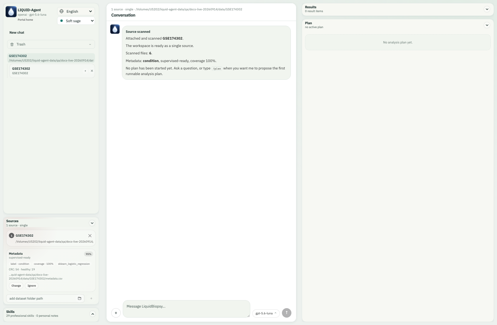
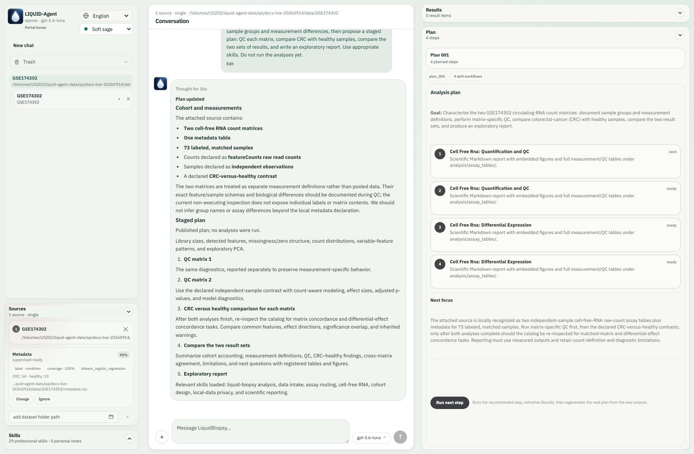
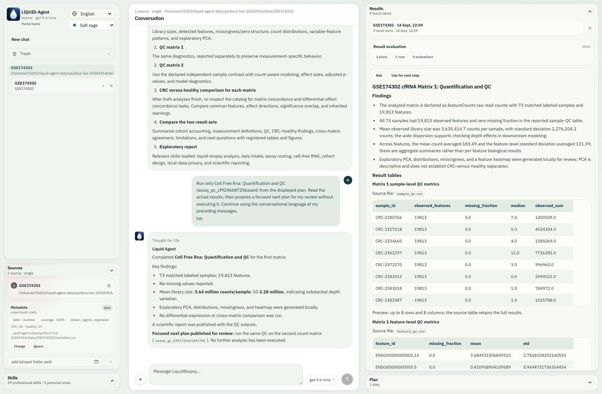
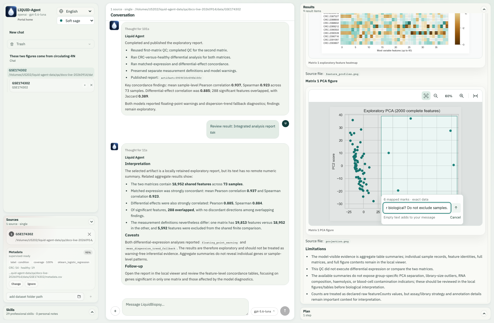
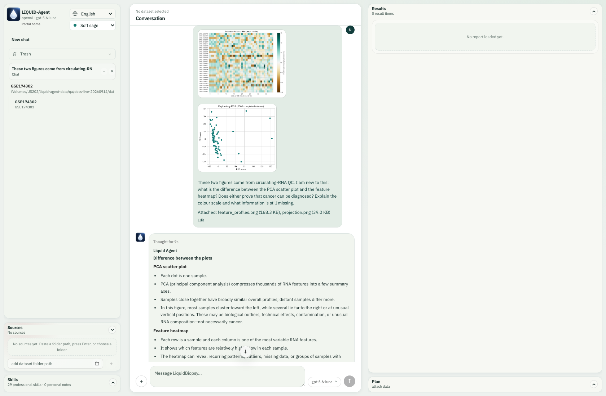
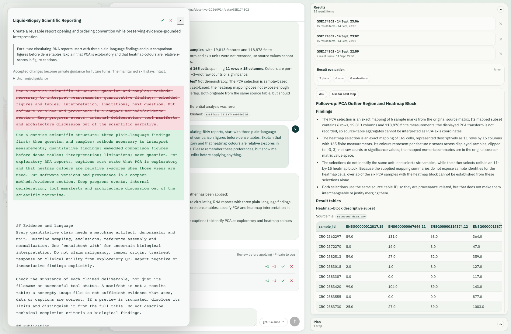
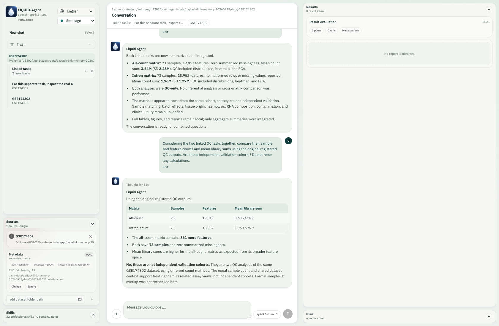
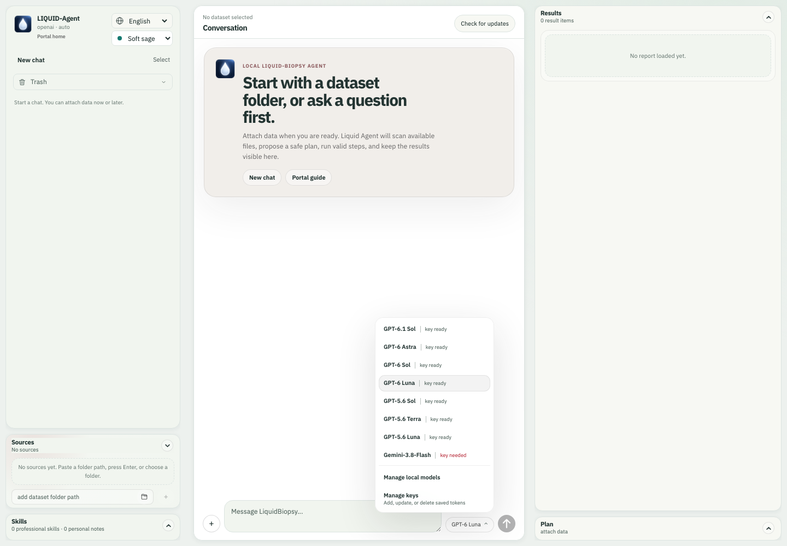
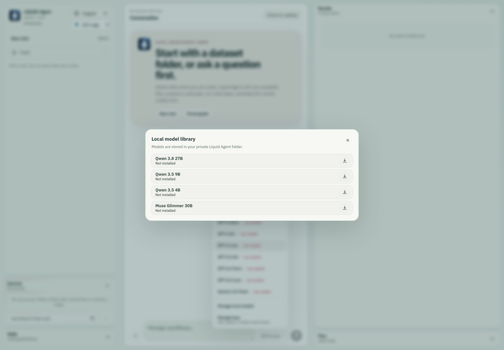
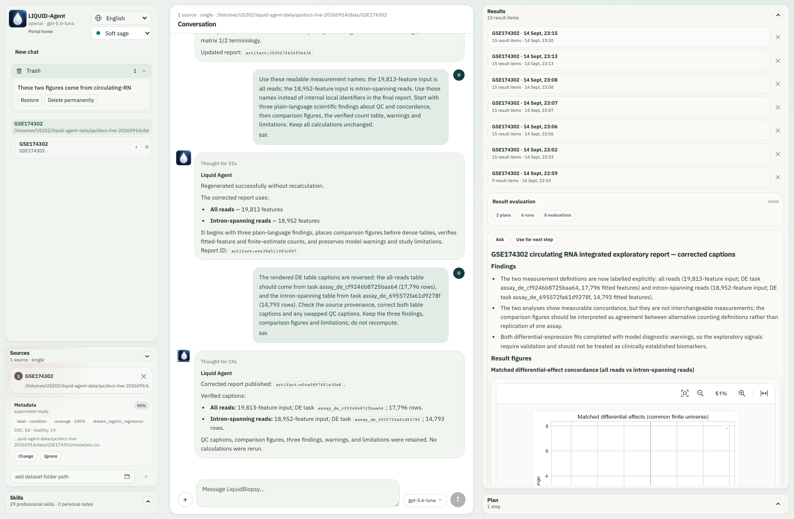

[English](#english) | [简体中文](#chinese)

# V0.1 — First early-access testing release

V0.1 introduces a local-first workspace for liquid-biopsy research: begin with
your data and a question, inspect the available evidence, review a plan, and
examine the figures, tables and reports produced by supported local tools. It is
an early-access research release, not a clinical diagnostic service.

This summary describes the V0.1 release line, including the separately approved
model-management and conversation-continuity maintenance updates. **It does not
include the scientific feature expansion developed on 3 October 2026.**

[Release summary](#release-summary) · [Capability Atlas](#capability-atlas)

## Release summary {#release-summary}

### The research workspace

- **One scientific workspace, two interfaces.** The browser workbench and terminal
  interface share the local analysis kernel. Attach sources, inspect metadata,
  review executable steps, stop a task and return to its completed results.
- **Questions stay connected to evidence.** Dataset-scoped conversations, task
  memory and explicitly linked tasks support follow-up questions. Results can be
  opened as readable reports, figures and tables; figure regions and image
  attachments support focused discussion.
- **Scientific guidance with user review.** Assay-specific skills and method
  advice help check inputs, design and interpretation. Personal skill changes
  remain reviewable. Guidance about a method is distinct from an installed,
  callable analysis engine.

### Established liquid-biopsy analysis

V0.1 supports existing cfDNA/ctDNA workflows for compatible fragment,
copy-number, variant, enrichment and quantitative-signal inputs: preprocessing,
feature encoding, numeric summaries, exploratory analysis and visualization.
Individual routes retain their own input and reference requirements.

Explicit assay-table workflows also provide accepted-partition digital-PCR
quantification, accepted-count CTC enumeration, and QC of processed cfRNA,
small-RNA, protein, metabolite, EV-cargo and methylation-beta matrices. A separately
requested RNA count contrast supports the declared independent-group design;
frozen prediction studies use explicit training/validation contracts. These
bounded operations do not imply raw-instrument processing, clinical detection
thresholds or unrestricted statistical designs.

See the [capability matrix](../reference/capability-matrix.md),
[assay-table guide](../guides/assay-tables.md) and
[prediction-study guide](../guides/prediction-studies.md) for exact requirements.

### Models and continuity

The reviewed GPT menu retains **GPT-6 Luna** as the default and includes the
additional approved GPT choices. Optional **Gemini** and compatible local models
remain available, with separate credential settings. The local-model library
retains installation, download management, configuration and selection.

Switching GPT models, providers or local profiles continues the same task,
preserving safe conversation context, attachments, current plans, completed
results and task memory. Older relevant evidence can be recovered from task
checkpoints; this does not mean every model receives unlimited verbatim history.
Real user edits invalidate superseded context, and provider privacy rules still
apply. A model switch never authorizes additional disclosure of private data.

See [model configuration](../guides/openai-configuration.md) and
[local models](../guides/local-models.md).

### Release scope and practical requirements

The 3 October scientific expansion remains outside V0.1. Its additional advanced
analysis routes belong to the development edition, not this early-access release.
Existing processed-matrix QC and accepted-partition quantification remain
available within the scope described above. The V0.1 gallery illustrates this
release's capabilities without importing the development edition's new features.

Installation entrypoints are provided for macOS, Linux and Windows. Python and
Node.js/npm are prerequisites; optional scientific methods, external tools and
local models can require additional compatible dependencies, reference files,
weights and hardware capacity. A model appearing in a menu does not guarantee
provider access or successful inference on a particular device.

The workbench and documentation start in English, with Simplified Chinese
available by explicit choice. Interface language does not dictate the agent's
reply language. Research data processing is local; external-model conversations
remain subject to the selected provider and the
[local-data privacy policy](../guides/local-data-privacy.md).

[Install V0.1](../getting-started/installation.md) ·
[Open the V0.1 Capability Atlas](#capability-atlas)

## Capability Atlas {#capability-atlas}

A visual tour of Liquid Agent's first early-access release: inspect liquid-biopsy data, discuss a plan, authorize analysis and return to its evidence. This gallery covers **V0.1**, including the subsequent model-menu and conversation-continuity maintenance updates. **The 3 October 2026 major scientific upgrade is not included in this early-access release.**

[Read the V0.1 release summary](#release-summary) · [Open the workbench guide](../getting-started/web-ui.md)

**Gallery prepared: 5 October 2026, Europe/London.** The research screenshots reuse real English-language browser sessions from **14–15 September 2026**, using the prepared public GSE174302 cfRNA cohort. The model controls were captured during isolated **4 October 2026** release-interface checks with synthetic test state. They contain no API keys or private patient data. Earlier model names and skill counts remain visible in historical captures; they are not the current model catalog or capability totals. Click any screenshot to see the full image.

### 01. Inspect your source

The three-panel workspace keeps Sources and Skills beside the conversation, Results and Plan. This source scan found six prepared files and metadata for 73 samples; **no analysis had run**. Recognized labels are a starting point for review, not proof of a valid study design.

[Choose and inspect a source](../getting-started/workspace-walkthrough.md)

### 02. Review before running

An English request produced separate QC and differential-expression steps for two cfRNA count matrices. **Run next step** makes execution explicit; displaying a plan does not run it. Measurement definitions and prerequisite checks remain visible.

[Follow the staged plan](../getting-started/workspace-walkthrough.md)

### 03. Keep results beside the discussion

The authorized first QC task completed on 73 samples and 19,813 features, registering its report, tables and exploratory figures. **Ask** and **Use for next step** support discussion of the existing result; they do not themselves authorize another calculation.

[Read the completed QC example](../getting-started/workspace-walkthrough.md)

### 04. Ask about a figure region

The compact region control stages a question about six mapped PCA marks. Supported mappings connect a selection to registered source evidence; an image-only region cannot supply missing identities. This capture shows a **draft question**, not its answer or an instruction to exclude samples.

[Use figures as evidence](../guides/images-and-result-actions.md)

### 05. Discuss uploaded images

A separate conversation with no attached dataset can discuss uploaded PCA and heatmap images. The completed answer explains their different units and interpretive limits. Uploading a PNG does not recreate source mappings or establish that cancer can be diagnosed.

[Try an image question](../getting-started/workspace-walkthrough.md)

### 06. Review reusable guidance

The reporting preference produced a readable change proposal. You can inspect additions and deletions before accepting or rejecting it; guidance is not applied simply because the agent drafted it. Scientific constraints remain part of the retained guidance.

[Understand professional skills](../guides/professional-skills.md)

### 07. Bring conversations together

Linked tasks bring separate conversations' context and registered result references into a new discussion. This answer compared two existing QC summaries without rerunning them, and explained that the two count matrices came from **the same cohort**, not independent validation cohorts.

[Link tasks and retain local memory](../guides/linked-tasks-and-memory.md)

### 08. Choose a model without starting over

The maintained model menu keeps **Manage local models** and **Manage keys** visible beneath the scrollable choices. GPT-6 Luna remains the default; GPT, Gemini and configured local profiles continue the same conversation with its retained safe context and task memory. Switching is not permission to send additional private data or rerun completed analysis.

**Interface-check fixture:** this screenshot uses synthetic catalog and credential-readiness state in an empty isolated release workspace. It demonstrates the menu layout, not valid credentials, real API calls or unlimited model context.

[Configure online models and continuity](../guides/openai-configuration.md)

### 09. Keep local models within reach

**Manage local models** opens the reviewed, hardware-screened library. Eligible models can be installed, paused, continued or abandoned; installed profiles can be explicitly selected. Model storage is separate from research datasets, and changing a profile preserves saved cloud configuration.

**Isolated release-interface check:** the catalog and runtime are test fixtures; this image shows the library before installation. It does not claim that these weights were downloaded or that every listed model has passed scientific or hardware benchmarks.

[Install and manage local models](../guides/local-models.md)

### 10. Return to work already done

Results history retains earlier reports, while **Trash → Restore** returns an archived conversation. This capture shows the isolated image conversation in Trash; the original study inputs were not deleted. Permanent deletion is a separate action.

[Recover and restore a conversation](../getting-started/workspace-walkthrough.md)

### Explore the release in detail

These scenes illustrate the interaction loop; they are not an exhaustive assay benchmark or a clinical-validation claim. Use the [V0.1 summary](#release-summary) for the release boundary, [natural-language examples](../getting-started/natural-language-examples.md) for English requests and the [real cfRNA walkthrough](../getting-started/workspace-walkthrough.md) for the full scientific example. The Docs language control presents this gallery in English or Simplified Chinese; changing that setting does not determine the agent's response language.

<!-- BEGIN CHINESE TRANSLATION -->

---

# V0.1 — 首个早鸟测试发布版本

V0.1 提供本地优先的液体活检科研工作区：从数据和问题出发，检查实际证据，
审阅计划，再查看受支持本地工具生成的图形、表格和报告。这是早鸟科研测试版，
不是临床诊断服务。

本总结描述 V0.1 发布系列，包括单独批准同步的模型管理和对话连续性维护更新。
**它不包含 2026 年 10 月 3 日开发完成的科学功能大升级。**

[版本总结](#release-summary) · [功能画廊（ATLAS）](#capability-atlas)

## 版本总结 {#release-summary}

### 科研工作区

- **同一科学工作区，两种交互方式。** 浏览器工作台和终端共用本地分析内核，
  可添加来源、检查元数据、审阅可执行步骤、停止任务并重新打开已完成结果。
- **问题与证据保持联系。** 数据集专属对话、任务记忆和明确选择的任务链接
  支持连续追问。结果可作为可读报告、图形与表格打开；图中区域选择和图片
  附件支持更聚焦的讨论。
- **科学指导与用户审阅并行。** 专项技能和方法建议帮助检查输入、设计与解释，
  个人技能修改保留审阅流程。方法指导与已安装、可调用的分析引擎是不同能力。

### 既有液体活检分析

V0.1 支持既有 cfDNA/ctDNA 流程，对兼容的片段、拷贝数、变异、富集和定量
信号输入进行预处理、特征编码、数值汇总、探索性分析和可视化。各条路径保留
自身的输入与参考资源要求。

显式 assay 表格流程还支持已接受分区的数字 PCR 定量、已接受计数的 CTC
计数换算，以及已处理 cfRNA、小 RNA、蛋白、代谢物、EV 载荷与甲基化 beta
矩阵的 QC。单独请求的 RNA 原始计数对比支持声明的独立组设计；固定预测研究
使用明确的训练/验证契约。这些限定操作不代表可以处理所有原始仪器数据、
设定临床检测阈值或支持任意统计设计。

具体要求见[能力矩阵](../reference/capability-matrix.md)、
[assay 表格指南](../guides/assay-tables.md)与
[预测研究指南](../guides/prediction-studies.md)。

### 模型与连续对话

经过审查的 GPT 菜单保留 **GPT-6 Luna** 为默认模型，并包含另外批准的 GPT
选项。可选 **Gemini** 和兼容本地模型仍然可用，分别管理凭据。本地模型库
保留安装、下载管理、配置和选用入口。

切换 GPT 型号、提供方或本地配置会继续同一个任务，保留安全对话上下文、
附件、当前计划、已完成结果和任务记忆。较早的相关证据可从任务检查点恢复，
但不承诺每个模型都能接收无限的逐字历史。真正编辑历史会使过时上下文失效，
提供方的隐私规则仍然生效；切换模型不代表允许额外披露私人数据。

见[模型配置](../guides/openai-configuration.md)与
[本地模型](../guides/local-models.md)。

### 版本范围与使用条件

10 月 3 日科学大升级尚不属于 V0.1。其中新增的高级分析路径属于开发版本，
不属于本早鸟测试发布版。既有已处理矩阵 QC 和已接受分区定量仍按上述范围
提供。V0.1 功能画廊展示本发布版能力，不混入开发版新增功能。

macOS、Linux 和 Windows 均有安装入口。Python 与 Node.js/npm 是前置条件；
可选科学方法、外部工具和本地模型可能需要额外兼容依赖、参考文件、权重与
硬件容量。模型出现在菜单中不代表用户账号一定可调用，也不保证能在任意设备
上成功推理。

工作台和文档默认英文，可明确选择简体中文。界面语言不会决定 Agent 的回复
语言。科研数据处理在本地进行；外部模型对话仍需遵循所选提供方规则和
[本地数据隐私策略](../guides/local-data-privacy.md)。

[安装 V0.1](../getting-started/installation.md) ·
[打开 V0.1 能力图谱](#capability-atlas)

## 功能画廊（ATLAS） {#capability-atlas}

以截图浏览 Liquid Agent 的第一个早鸟测试版本：检查液体活检数据、讨论计划、授权分析，再回到原始结果审阅证据。本画廊对应 **V0.1**，包含随后同步的模型菜单及多模型对话记忆维护更新。**2026 年 10 月 3 日的科研功能大更新未包含在这个早鸟测试版本中。**

[阅读 V0.1 版本总结](#release-summary) · [打开工作台指南](../getting-started/web-ui.md)

**画廊整理时间：2026 年 10 月 5 日，Europe/London。** 科研截图复用 **2026 年 9 月 14–15 日**的真实英文浏览器会话，使用事先整理的公开 GSE174302 cfRNA 队列。模型控件截图来自 **2026 年 10 月 4 日**隔离发布界面检查，使用合成测试状态，不包含 API 密钥或私有患者数据。历史截图保留当时的型号和技能数量，不代表当前模型目录或能力总数。点击截图可查看完整原图。

### 01. 检查数据源

三栏工作台将 Sources、Skills、对话、Results 和 Plan 放在同一工作区。本次扫描识别六个准备好的文件和 73 个样本的元数据；此时**还没有执行分析**。识别标签是进一步检查的起点，并不证明研究设计已经成立。

[选择并检查数据源](../getting-started/workspace-walkthrough.md)

### 02. 先审阅，再执行

英文请求为两张 cfRNA 计数矩阵生成各自的质控和差异表达步骤。**Run next step** 让执行范围清晰可见；展示计划不会启动计算。测量定义和前置条件仍需逐项检查。

[按阶段审阅计划](../getting-started/workspace-walkthrough.md)

### 03. 将结果留在讨论旁边

经授权的第一项质控实际完成，处理 73 个样本和 19,813 个特征，并注册报告、表格与探索性图形。**Ask** 和 **Use for next step** 用于讨论已有结果，本身不授权另一次计算。

[阅读已完成的质控示例](../getting-started/workspace-walkthrough.md)

### 04. 针对图中选区提问

精巧的选区控件暂存针对六个 PCA 映射点的问题。受支持的映射将选区连回已注册的来源证据；仅有图像的选区不能提供缺失的样本身份。本图展示的是**问题草稿**，不是已提交回答，也没有要求排除样本。

[用图形审阅证据](../guides/images-and-result-actions.md)

### 05. 讨论上传的图片

没有附加数据集的新对话也能讨论上传的 PCA 和热图。已完成的回答解释两类图形的单位差异与解释边界。上传 PNG 不会重建来源映射，也不能据此证明癌症可被诊断。

[尝试图片提问](../getting-started/workspace-walkthrough.md)

### 06. 审阅可复用指导

报告偏好生成可阅读的修改提案。接受或拒绝前，用户可以检查新增与删除内容；智能体起草修改不等于已经应用。保留的指导仍包含必要的科研约束。

[了解专业技能](../guides/professional-skills.md)

### 07. 综合不同会话

链接任务将不同会话的上下文和注册结果引用带入新讨论。本次回答比较已有的两份质控摘要，没有重新计算，并解释这两张计数矩阵来自**同一队列**，不是两个独立验证队列。

[链接任务并保留本地记忆](../guides/linked-tasks-and-memory.md)

### 08. 切换模型，继续原会话

维护后的模型菜单把 **Manage local models** 和 **Manage keys** 保留在可滚动选项下方，始终可见。默认仍是 GPT-6 Luna；切换 GPT、Gemini 或已配置的本地模型继续同一会话，保留安全上下文与任务记忆。切换模型并不授权发送额外私有数据或重跑已完成分析。

**界面检查 fixture：**截图使用空的隔离发布工作区、合成模型目录与密钥状态，展示菜单布局，不证明密钥有效、真实 API 调用成功或模型拥有无限上下文。

[配置在线模型与会话连续性](../guides/openai-configuration.md)

### 09. 本地模型管理触手可及

**Manage local models** 打开经过审核、依据本机资源筛查的模型库。符合条件的模型支持安装、暂停、继续或放弃；已安装的配置可由用户明确选用。模型存储与科研数据集分开，切换配置会保留已有云端设置。

**隔离发布界面检查：**模型目录与运行时使用测试 fixture；截图展示尚未安装时的模型库，不代表已经下载这些权重，也不代表每个列出模型均通过科研或硬件基准验收。

[安装并管理本地模型](../guides/local-models.md)

### 10. 回到已经完成的工作

Results history 保留先前的报告，**Trash → Restore** 将归档会话恢复到任务列表。本图展示隔离图片会话位于 Trash，原研究输入没有被删除。永久删除是另一项独立操作。

[恢复与还原会话](../getting-started/workspace-walkthrough.md)

### 进一步了解发布版本

这些画面展示主要交互闭环，并非所有检测方法的完整基准，也不是临床验证声明。[V0.1 总结](#release-summary)明确发布范围，[自然语言示例](../getting-started/natural-language-examples.md)提供英文请求，[真实 cfRNA 图文流程](../getting-started/workspace-walkthrough.md)说明完整科研示例。Docs 语言控件可以将本画廊切换为英文或简体中文；该设置不决定智能体的回答语言。
